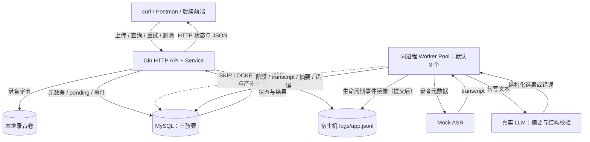

# 录音转写与智能摘要服务

使用 Go 与 MySQL 设计的异步录音处理 API：上传音频后创建任务，通过 Mock ASR 生成转写文本，再调用真实 LLM 生成结构化摘要。

**当前处于设计阶段。已有总体架构、详细设计与开发计划，尚无可运行服务。** 本文区分当前文档与计划交付能力；运行命令是后续实现约定，尚未经过运行验证。

## 需求与文档

- [需求原文](后端实习生笔试项目：「录音转写服务」API.md)
- [总体架构：组件、端到端数据流、数据模型、状态机与部署拓扑](docs/design/architecture.md)
- [详细技术设计：存储选型对比、DDD 分层、并发、事务协议、事件日志与错误码](docs/design/technical-design.md)
- [测试设计：单元 / 集成 / E2E 用例与预期-真实比对机制](docs/design/test-design.md)
- [开发任务文档：T01～T14 逐任务执行（顺序、预算与完成勾选）](docs/plan/tasks/T01-bootstrap.md)

题目要求在 7 个自然日内提交，预计实际工作量 12～16 小时；保留完整 commit 历史，并提供 README、一键启动方式和 API 调试文件。前端、鉴权和高并发优化不属于考察范围。

## 功能范围与当前进度

| 能力 | 交付优先级 | 当前状态 |
| --- | --- | --- |
| 音频上传、列表、详情、任务查询、重试、删除 | P0 | 已设计，待实现 |
| Mock 转写：随机 5～15 秒，约 20% 失败 | P0 | 已设计，待实现 |
| 真实 LLM 摘要及超时、非法输出处理 | P0 | 已设计，渠道待确定 |
| 统一错误、生命周期日志、SQL 迁移 | P0 | 错误码注册表与日志双写已实现（T01）；三表迁移 SQL 与只前滚执行器已实现（T02） |
| Compose 一键启动、API 调试文件 | 必交材料 | 已规划，待实现 |
| 固定 worker 并发、核心测试 | 优先加分项 | 已规划，待实现 |
| 事件表、文件日志与单实例重启恢复 | 14 小时基线，恢复为加分项 | 已设计，待实现 |
| 前端、真实 ASR、SSE、上传幂等、公网演示 | 后续扩展 | 未纳入首轮范围 |

## 架构与流程



实线为数据和请求响应，虚线为后台调度。上传等待接收文件、落盘与事务提交，随后返回 202/pending，不等待转写或摘要。任务依次进入 transcribing、summarizing、done，出错进入 failed。


完整数据流（含事务边界的端到端时序图）、ER 图与状态机见架构文档；[SVG 版本](docs/design/assets/architecture.svg) 可单独导出使用。

## 表结构设计

| 表 | 核心字段 | 约束与用途 |
| --- | --- | --- |
| recordings | id、original_filename、storage_path、extension、size_bytes、content_hash、deleting_at、created_at、updated_at | UUID 主键、唯一路径；本地文件元数据、流式 SHA-256（去重预留）及删除恢复标记 |
| tasks | id、recording_id、status、attempt、transcript、summary_json、error_code、error_message、created_request_id、执行时间 | recording_id 为唯一逻辑关联；应用事务显式删除；数字错误码；摘要 JSON |
| task_events | event_id、task_id、event_seq、attempt、event、状态转换、数字错误、耗时 | 与状态同事务写入，UNIQUE(task_id,event_seq)，无物理外键 |

一条录音对应一个逻辑任务，重试复用 task_id 并递增 attempt，event_seq 跨轮次递增。ID 为 CHAR(36) ASCII，时间使用 UTC DATETIME(6)，接口输出 RFC3339；文件大小为 BIGINT。任务队列索引为 (status, created_at, id)，列表按 (created_at DESC, id DESC) 排序。具体字段见架构文档，编号迁移 SQL 将随实现放入 `migrations/`，目前尚未创建。

任务状态和 task_events 必须同一事务提交，event_seq 与 event_id 分别用于顺序和去重。最终删除录音时，同一事务清理三表；事件在提交后镜像到 logs/app.jsonl（尽力而为），文件按轮转周期保留。

## DDD 与日志观测

目录采用 interfaces、application、domain、infrastructure 四层，bootstrap 组装。Recording 为聚合根，ProcessingTask 为内部实体；完整目录与事务端口见详细设计的 DDD 章节。

运行时规划单一 `logs/app.jsonl` 同时保存访问日志、任务事件镜像与运行诊断，并输出控制台。任务事件与状态同事务落库，提交后镜像到文件（尽力而为）；按 task_id 可跨重试/恢复查看全周期，按 event_seq 排序。日志目录与轮转文件不提交 Git。

实现后的示例观察命令（当前无运行日志）：

```bash
jq -c 'select(.task_id == "task-example")' logs/app.jsonl
```

事件表可用 `SELECT * FROM task_events WHERE task_id = ? ORDER BY event_seq` 查询。任务事件不含音频、转写或摘要正文。完整格式与删除边界见详细设计的事件日志章节。

## API 约定

以下为设计契约，服务尚未实现。

| 方法与路径 | 用途 | 成功状态 |
| --- | --- | --- |
| POST /v1/recordings | multipart 上传，字段 file | 202 |
| GET /v1/tasks/{task_id} | 查询任务阶段与错误 | 200 |
| GET /v1/recordings?page=1&page_size=20 | 分页列表与任务状态 | 200 |
| GET /v1/recordings/{id} | 录音详情、转写和摘要 | 200 |
| POST /v1/tasks/{task_id}/retry | 仅 failed 可重试 | 202 |
| DELETE /v1/recordings/{id} | 删除录音文件与关联数据 | 204 |

音频扩展名仅接受 wav/mp3/m4a/aac，大小上限按 50 MiB（50 × 1024 × 1024 字节）实现；上传全程流式处理并同步计算 SHA-256 存入 content_hash（去重预留），不做解码或 MIME 检测，空文件返回 400。分页 page_size 默认 20、最大 100。

错误保留合理 HTTP 状态，并返回稳定的 JSON 数字业务 code，例如 HTTP 409：

```json
{
  "error": {
    "code": 30002,
    "message": "仅失败任务允许重试",
    "request_id": "req-example"
  }
}
```

失败任务查询仍返回 200，并通过 task.status=failed 与 task.error.code 描述后台失败，例如 50001（LLM_TIMEOUT）。完整码表与网络超时处理规则见详细设计的错误码章节。

## 运行方式（实现目标，当前不可执行）

后续仓库将提供 `Makefile`、`Dockerfile`、`compose.yaml`、`.env.example`、迁移 SQL 和 `api/recordings.http`。这些文件当前尚未交付，以下命令只定义预期使用方式，不表示服务已经能启动。

所有日常操作统一经 Makefile 进入，底层封装 Docker Compose 与 Go 工具链，不要求记忆底层命令：

| 命令 | 作用 |
| --- | --- |
| `make check` | 环境自检：Docker 与 Compose 可用性、Go 版本、`.env` 关键配置（数据库与 LLM）是否就绪；逐项输出 OK / 缺失，可单独执行，也被 `start` / `dev` 自动先行调用 |
| `make setup` | 环境初始化：复制 `.env.example` 为 `.env` 并提示填写数据库与 LLM 配置；检查 Docker 与 Go 版本 |
| `make build` | 显式构建 / 更新 app 镜像；代码变更后执行。`start` 只在镜像不存在时才构建，不会自动重建已有镜像 |
| `make start` | 容器方式启动：自动先执行 `make check`；复用本地已有镜像启动 app + db（等价 `docker compose up -d`，镜像缺失才构建、db 镜像缺失才拉取），等待 `/readyz` 就绪后返回 |
| `make dev` | 本地开发启动：自动先执行 `make check`；只以 Compose 起 db 依赖（已在运行则直接复用），应用直接 `go run` 连本地环境，日志输出终端，便于断点与快速迭代；不构建应用镜像 |
| `make down` | 停止并移除容器（适用 `start` 与 `dev` 两种方式）；保留数据卷与 `./logs` |
| `make logs` | 跟踪应用与数据库日志 |
| `make test` | 全量测试：单元恒跑；集成与 E2E golden 需 `TEST_MYSQL_DSN`（未设则逐层跳过并提示）；并发相关包附带 `-race` |
| `make e2e` | 仅 E2E golden 过程级套件（需 `TEST_MYSQL_DSN`，未设则跳过并提示）；另设 `E2E_COMPOSE=1` 时附带 compose 全栈冒烟 E-COMPOSE（需 Docker 与 `make build` 镜像，栈复用不 down；机制见[测试设计](docs/design/test-design.md)） |
| `make lint` | `go vet` 与 golangci-lint |
| `make clean` | 清理构建产物与本地 `logs/`；不动数据卷 |

最短启动路径只需两步；日常开发迭代用 `make dev` 免构建镜像：

```bash
make setup    # 生成 .env，按提示填入 LLM 配置
make start    # 自检环境后一键启动（复用已有镜像）并等待就绪
# 代码变更后需要重建镜像时：make build
```

预期服务地址为 `http://localhost:8080`。Compose 将宿主机 ./logs 绑定到 /app/logs，录音与 MySQL 数据使用持久化卷。数据库健康后，应用自动执行未应用的迁移、恢复任务及删除清理，再通过 `/readyz` 表示可用；`/healthz` 表示进程存活。LLM 不在健康检查中真实调用，避免周期性消耗额度。

| 计划配置项 | 作用 | 预期默认/要求 |
| --- | --- | --- |
| HTTP_ADDR | 监听地址 | :8080 |
| MYSQL_DSN | go-sql-driver/mysql DSN | 必填；自包含方式与 db 服务一致，本机已有共享 MySQL 时直接指向该实例内的 recording 库 |
| MYSQL_PORT | 自带 db 容器的宿主端口映射 | 3306；宿主 3306 被占用时改（如 3307），DSN 同步 |
| MYSQL_DATABASE / MYSQL_USER / MYSQL_PASSWORD | Compose 数据库初始化 | 数据库与用户可提供开发默认，密码本地设置 |
| MYSQL_ROOT_PASSWORD | MySQL 容器初始化管理密码 | 本地设置，应用使用独立 MYSQL_USER |
| LOG_DIR | 容器内日志目录 | /app/logs，绑定宿主机 ./logs |
| LOG_LEVEL | 运行日志级别 | INFO；生命周期事件不因调高级别被丢弃 |
| LOG_MAX_SIZE_MB / LOG_MAX_BACKUPS / LOG_MAX_AGE_DAYS | 文件轮转 | 20 / 5 / 7 |
| DATA_DIR | 应用内录音目录 | /data/recordings，挂载录音卷 |
| UPLOAD_MAX_FILE_MB | 单文件上限（流式计数，不信任 Content-Length） | 50（= 50×1024×1024 字节） |
| UPLOAD_MAX_BODY_MB | 请求体总上限（预留 multipart 开销） | 53 |
| UPLOAD_MIN_FREE_DISK_MB | 数据目录磁盘预检阈值，不足拒绝上传 | 512 |
| UPLOAD_READ_TIMEOUT / UPLOAD_TOTAL_TIMEOUT | 上传读空闲 / 总超时（分开配置） | 30s / 10m |
| WORKER_CONCURRENCY | 最大同时执行数 | 3 |
| TASK_POLL_INTERVAL | 待处理任务轮询 | 1s |
| LLM_BASE_URL / LLM_MODEL | 真实摘要渠道 | 按所选供应商配置 |
| LLM_API_KEY | 调用凭据 | 云端渠道按需必填；本地渠道按适配器约定 |
| LLM_TIMEOUT | 单次调用超时 | 60s |

运行时会校验必要配置并尽早报错；不静默降级到 Mock 摘要。真实渠道和具体参数在实现联调后更新为已验证配置，密钥不进入仓库。

预计调试入口：上传音频，使用返回 task_id 轮询，再按 recording_id 查结果；`api/recordings.http` 将覆盖六个接口。当前不提供伪造的成功运行结果。

## 技术取舍与重启行为

- 数据库选 MySQL：题目推荐的三种关系库逐项对比（任务认领锁、JSON、部署、RETURNING、使用熟悉度）以及关系型与非关系型方案的取舍，见详细设计第 1 节；结论的核心理由是预算内的调试与解释成本，原生 JSON 足够保存 LLM 结构化结果，使用事务内更新再查询，不使用 PostgreSQL RETURNING，不作无基准的性能排名。
- HTTP 选择 Gin，数据访问使用 GORM（底层 go-sql-driver/mysql），关键路径以锁子句（FOR UPDATE SKIP LOCKED）与条件更新（RowsAffected）显式控制并发语义；goroutine worker、channel 唤醒、context、WaitGroup 与 slog JSON 日志的用法见详细技术设计。
- recording_id 使用逻辑关联，保留 UNIQUE/NOT NULL/CHECK，不创建物理外键；应用负责事务内成对创建、显式删除和关联巡检。
- tasks 表承担持久化队列，3 个 worker 限制并发，无需额外 Redis；领取任务使用行锁和 SKIP LOCKED，事务结束后再执行耗时调用。
- 14 小时基线：启动前将中断的 transcribing/summarizing 任务重置为 pending，attempt 加一，清空产物并从头处理；pending 保留，done/failed 不自动重跑。逐崩溃窗口的恢复动作与启动流程见详细设计第 6 节。
- 恢复可能重复调用外部 LLM，不保证恰好执行一次。当前仅支持一个应用实例；独立 MySQL 不消除这个应用约束。
- 手动重试从头执行，同一轮重复请求返回 409；跨执行轮次的严格请求幂等尚未实现。
- 允许删除处理中录音，以删除标记、执行取消、条件写入和可恢复文件清理避免迟到结果回写。

任务生命周期事件与状态同事务落库；日志文件写入失败可重放，表与文件不承诺跨系统原子提交。

## 测试与验收（待实现）

计划使用确定性转写/摘要替身与本地 HTTP 假服务覆盖状态机、LLM 超时/非法输出、重复重试、并发认领和处理中删除。数据库集成测试使用专用 MySQL 测试库，禁止指向业务数据；真实 LLM 单独人工验收，不依赖它运行单元测试。

目标交付包括通过 `go test ./...`、隔离数据库集成测试及必要的 race 检查，具体集成测试命令随测试设施落地后补充。当前尚无业务代码，未运行业务测试。完整用例设计（单元 / 集成 / E2E 分层、替身设施、E2E 预期结果先行构造并与真实运行结果逐字段比对的机制）见[测试设计](docs/design/test-design.md)；排期验收见开发计划。

## 已知限制与后续扩展

当前所有业务功能、容器启动、迁移与测试均待实现；本 README 为设计阶段初稿，正式提交前必须据实更新功能状态和运行验证结果。

首轮设计限制包括：无前端/鉴权、Mock ASR、单应用实例、本地文件、无上传幂等、无自动重试、无 SSE、无公网部署。录音列表无法可靠消除上传响应丢失带来的重复上传风险。

API 服务可以独立部署，前端不是部署前提。后续可先做上传、列表、阶段轮询、详情、重试、删除的最小界面；真实 ASR 则替换 Transcriber 实现，增加音频读取、供应商超时和错误映射，保留现有任务 API。两项均在首轮验收后单独估时。
