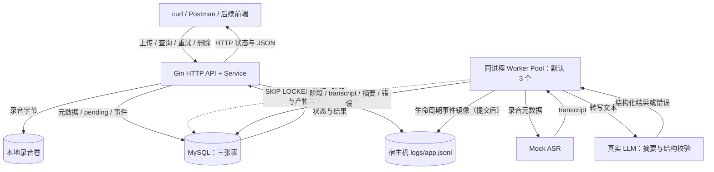

# 录音转写与智能摘要服务

使用 Go 与 MySQL 的异步录音处理 API：上传音频后创建任务并立即返回 202，后台 Worker 池完成 Mock 转写与 LLM 结构化摘要，支持任务查询、分页列表、详情、失败重试与安全删除。

服务已全部实现并通过三层测试（单元 / 集成 / 过程级 E2E golden 比对）与 compose 全栈冒烟；一键启动、迁移 SQL、API 调试文件齐备。摘要渠道为 OpenAI 兼容适配器（默认小米 MiMo），**适配器按 OpenAI 兼容规范实现并通过确定性替身全量验证，真实渠道冒烟因暂无 API Key 尚未执行**（见「已知问题与缺口」）。

## 需求与文档

- [需求原文](后端实习生笔试项目：「录音转写服务」API.md)
- [总体架构：组件、端到端数据流、数据模型、状态机与部署拓扑](docs/design/architecture.md)
- [详细技术设计：存储选型对比、DDD 分层、并发、事务协议、事件日志与错误码](docs/design/technical-design.md)
- [测试设计：单元 / 集成 / E2E 用例与预期-真实比对机制](docs/design/test-design.md)
- [开发任务文档：T01～T14 逐任务执行（顺序、预算与完成勾选）](docs/plan/tasks/T01-bootstrap.md)

## 功能范围与交付状态

| 能力 | 交付优先级 | 状态 |
| --- | --- | --- |
| 六接口：上传、任务查询、列表、详情、重试、删除 | P0 | 已实现（三层测试 + compose 冒烟覆盖） |
| Mock 转写：随机 5～15 秒、约 20% 失败（可注入确定性替身） | P0 | 已实现 |
| LLM 摘要：超时、非法输出、上游错误分类处理 | P0 | 已实现（OpenAI 兼容适配器；真实渠道冒烟待 Key） |
| 统一错误码、生命周期日志、SQL 迁移 | P0 | 已实现（错误注册表 + 事件表同事务落库 + jsonl 镜像；`migrations/0001_init.sql` 只前滚执行） |
| Compose 一键启动、API 调试文件 | 必交材料 | 已实现（`make start` 两步启动已实测；`api/recordings.http` 六接口；另附 `/ui` 联调页） |
| 固定 worker 并发、核心测试 | 优先加分项 | 已实现（3 worker SKIP LOCKED 认领；单元/集成/E2E 三层 `-race` 全绿） |
| 单实例重启恢复 | 加分项 | 已实现（启动恢复 + `/readyz` 就绪门控，reset 默认 / interrupt 可选） |
| 前端、真实 ASR、SSE、上传幂等、公网演示 | 后续扩展 | 未纳入首轮范围（见「已知问题与缺口」） |

## 架构与流程



实线为数据和请求响应，虚线为后台调度。上传等待接收文件、落盘与事务提交，随后返回 202/pending，不等待转写或摘要。任务依次进入 transcribing、summarizing、done，出错进入 failed。


完整数据流（含事务边界的端到端时序图）、ER 图与状态机见架构文档；[SVG 版本](docs/design/assets/architecture.svg) 可单独导出使用。

## 表结构

| 表 | 核心字段 | 约束与用途 |
| --- | --- | --- |
| recordings | id、original_filename、storage_path、extension、size_bytes、content_hash、deleting_at、created_at、updated_at | UUID 主键、唯一路径；本地文件元数据、流式 SHA-256（去重预留）及删除恢复标记 |
| tasks | id、recording_id、status、attempt、transcript、summary_json、error_code、error_message、created_request_id、执行时间 | recording_id 为唯一逻辑关联；应用事务显式删除；数字错误码；摘要 JSON |
| task_events | event_id、task_id、event_seq、attempt、event、状态转换、数字错误、耗时 | 与状态同事务写入，UNIQUE(task_id,event_seq)，无物理外键 |

一条录音对应一个逻辑任务，重试复用 task_id 并递增 attempt，event_seq 跨轮次递增。ID 为 CHAR(36) ASCII，时间使用 UTC DATETIME(6)，接口输出 RFC3339；文件大小为 BIGINT。任务队列索引为 (status, created_at, id)，列表按 (created_at DESC, id DESC) 排序。完整字段见 [`migrations/0001_init.sql`](migrations/0001_init.sql)（启动时自动执行、只前滚）。

任务状态和 task_events 必须同一事务提交，event_seq 与 event_id 分别用于顺序和去重。最终删除录音时，同一事务清理三表；事件在提交后镜像到 logs/app.jsonl（尽力而为），文件按轮转周期保留。

## DDD 与日志观测

目录采用 interfaces、application、domain、infrastructure 四层，bootstrap 组装。Recording 为聚合根，ProcessingTask 为内部实体；完整目录与事务端口见详细设计的 DDD 章节。

运行时单一 `logs/app.jsonl` 同时保存访问日志、任务事件镜像与运行诊断，并输出控制台。任务事件与状态同事务落库，提交后镜像到文件（尽力而为）；按 task_id 可跨重试/恢复查看全周期，按 event_seq 排序。日志目录与轮转文件不提交 Git。

按 task_id 观察生命周期（实测可用）：

```bash
jq -c 'select(.task_id == "<task_id>")' logs/app.jsonl
```

事件表可用 `SELECT * FROM task_events WHERE task_id = ? ORDER BY event_seq` 查询。任务事件不含音频、转写或摘要正文。完整格式与删除边界见详细设计的事件日志章节。

## API

六个接口与 `api/recordings.http`（可直接导入 VS Code REST Client / GoLand HTTP Client，含变量与重试操作路径注释）一一对应：

| 方法与路径 | 用途 | 成功状态 |
| --- | --- | --- |
| POST /v1/recordings | multipart 上传，字段 file | 202 |
| GET /v1/tasks/{task_id} | 查询任务阶段与错误 | 200 |
| GET /v1/recordings?page=1&page_size=20 | 分页列表与任务状态 | 200 |
| GET /v1/recordings/{id} | 录音详情、转写和摘要 | 200 |
| POST /v1/tasks/{task_id}/retry | 仅 failed 可重试 | 202 |
| DELETE /v1/recordings/{id} | 删除录音文件与关联数据 | 204 |

另有两个开发辅助入口：`GET /ui` 为浏览器联调页（服务自身托管、同源直连避免 CORS；单文件原生 JS，覆盖上述六接口，属开发辅助——需求不考察前端）；`/healthz` 进程存活、`/readyz` 就绪门控（启动恢复全部完成才就绪）。

音频扩展名仅接受 wav/mp3/m4a/aac，大小上限按 50 MiB（50 × 1024 × 1024 字节）实现；上传全程流式处理并同步计算 SHA-256 存入 content_hash（去重预留），不做解码或 MIME 检测，空文件返回 400。分页 page_size 默认 20、最大 100。

错误保留合理 HTTP 状态，并返回稳定的 JSON 数字业务 code，例如对非 failed 任务重试返回 HTTP 409：

```json
{
  "error": {
    "code": 30002,
    "message": "仅失败任务允许重试",
    "request_id": "req-example"
  }
}
```

失败任务查询仍返回 200，并通过 task.status=failed 与 task.error.code 描述后台失败，例如 50002（LLM 上游错误）。实测示例（占位 Key 直连真实渠道，错误消息只含状态码、不含 Key 与堆栈）：

```json
"error": { "code": 50002, "message": "llm upstream error: HTTP 401" }
```

完整码表与网络超时处理规则见详细设计的错误码章节。

## 运行方式

所有日常操作统一经 Makefile 进入，底层封装 Docker Compose 与 Go 工具链。最短启动路径两步（本机实测通过）：

```bash
make setup    # 生成 .env，按提示填入 LLM_API_KEY
make start    # 自检环境后一键启动（复用已有镜像）并等待 /readyz 就绪
# 代码变更后需要重建镜像时：make build；本地免镜像迭代用 make dev
```

服务地址 `http://localhost:8080`，联调页 `http://localhost:8080/ui`。Compose 将宿主机 ./logs 绑定到 /app/logs，录音与 MySQL 数据使用持久化卷。数据库健康后，应用自动执行未应用的迁移、恢复任务及删除清理，再通过 `/readyz` 表示可用；`/healthz` 表示进程存活。LLM 不在健康检查中真实调用，避免周期性消耗额度。

| 命令 | 作用 |
| --- | --- |
| `make check` | 环境自检：Docker 与 Compose 可用性、Go 版本、`.env` 关键配置（数据库与 LLM）逐项输出 OK / 缺失；被 `start` / `dev` 自动先行调用 |
| `make setup` | 复制 `.env.example` 为 `.env`（已存在不覆盖）并提示填写 |
| `make build` | 显式构建 / 更新 app 镜像；代码变更后执行。`start` 只在镜像不存在时才构建，不会自动重建已有镜像 |
| `make start` | 容器方式启动：先 `check`；起 app + db（复用已有容器，仅缺失时构建/拉取），等待 `/readyz` 就绪 |
| `make dev` | 本地开发：纯 `go run` 直连本地 `.env`（日常联调连已有 MySQL，如共享实例；**不起任何容器**，用过 `make start` 先 `make down` 释放 8080） |
| `make down` | 停止并移除容器；保留数据卷与 `./logs` |
| `make logs` | 跟踪应用与数据库日志 |
| `make test` | 全量测试：单元恒跑；集成与 E2E golden 需 `TEST_MYSQL_DSN`（未设逐层跳过并提示）；race 检查附带 |
| `make e2e` | 仅 E2E golden 过程级套件（需 `TEST_MYSQL_DSN`）；另设 `E2E_COMPOSE=1` 附带 compose 全栈冒烟 E-COMPOSE（需 Docker 与 `make build` 镜像） |
| `make lint` | `go vet` 与 golangci-lint（未安装则提示后跳过，vet + gofmt 已执行） |
| `make clean` | 清理构建产物与本地 `logs/`；不动数据卷 |

| 配置项 | 作用 | 默认 |
| --- | --- | --- |
| HTTP_ADDR | 监听地址 | :8080 |
| MYSQL_DSN | go-sql-driver/mysql DSN | 必填（自包含方式指 compose db，见 `.env.example` 注释） |
| MYSQL_PORT | 自带 db 容器的宿主端口映射 | 3306；宿主被占用时改（如 3307），DSN 同步 |
| MYSQL_DATABASE / MYSQL_USER / MYSQL_PASSWORD / MYSQL_ROOT_PASSWORD | Compose 数据库初始化 | recording / recording / 见 `.env.example` |
| LOG_DIR / LOG_LEVEL | 日志目录与级别 | /app/logs（本地 ./logs）/ INFO |
| LOG_MAX_SIZE_MB / LOG_MAX_BACKUPS / LOG_MAX_AGE_DAYS | 文件轮转 | 20 / 5 / 7 |
| DATA_DIR | 应用内录音目录 | /data/recordings（本地 ./data/recordings） |
| UPLOAD_MAX_FILE_MB / UPLOAD_MAX_BODY_MB | 单文件 / 请求体上限（流式计数） | 50 / 53 |
| UPLOAD_MIN_FREE_DISK_MB | 数据目录磁盘预检阈值 | 512 |
| UPLOAD_READ_TIMEOUT / UPLOAD_TOTAL_TIMEOUT | 上传读空闲 / 总超时 | 30s / 10m |
| WORKER_CONCURRENCY / TASK_POLL_INTERVAL | 并发与轮询 | 3 / 1s |
| LLM_BASE_URL / LLM_MODEL / LLM_API_KEY / LLM_TIMEOUT | OpenAI 兼容渠道配置 | `https://api.xiaomimimo.com/v1` / mimo-v2-flash / 必填 / 60s |
| RECOVERY_MODE | 启动恢复策略 | reset（在途重置重做）；interrupt（12h 降级）备选 |
| DB_QUERY_TIMEOUT / SHUTDOWN_TIMEOUT / CLEANUP_INTERVAL | 查询 / 停机 / 清理周期 | 3s / 20s / 30s |

运行时校验必要配置并尽早报错（DB 连接/迁移失败会向 stderr 输出一行原因后非零退出，容器日志可直接诊断）；不静默降级到 Mock 摘要。密钥只经 `.env` 注入，不进仓库。国内网络备注：镜像构建默认走 goproxy.cn（`--build-arg GOPROXY=...` 可覆盖），基础镜像可经 `GO_IMAGE` / `RUNTIME_IMAGE` 换加速源（见 `.env.example`）。

## 演示走查

一键启动后按 `api/recordings.http` 或 `/ui` 联调页走六个接口（本机实测记录，详见 T14 任务文档验收记录）：

1. `make start`：自检 → 迁移（日志 `db ready`）→ 启动恢复 → `/readyz` 就绪；
2. 上传 8KiB wav → `202 {"status":"pending"}`；
3. 轮询 `GET /v1/tasks/{id}`：pending → transcribing → summarizing → 终态（每次阶段变化 attempt 恒为当前轮次）；
4. 成功摘要：done 后详情 `transcript` 与 `result.summary/key_points/todos` 来自 LLM（确定性替身下为 FakeNormalSummary；真实渠道结果见「已知问题与缺口」）；
5. 失败与手动重试：占位 Key 下任务 failed/50002 → `POST /retry` → `202 attempt=2` 重新入队；
6. `GET /v1/recordings?page=1&page_size=20` 分页倒序；`DELETE /v1/recordings/{id}` → 204，文件删除与三表清理在返回前已同步完成、列表即刻不可见；失败时保留标记（503/20006），由后台清理循环续做；
7. 在途重启恢复与两阶段退出的过程级证据见 E2E-06（重启恢复）与 T10 报告（Ctrl-C 两阶段停机）。

## 测试与验收

三层测试全部 `-race` 实跑通过（2026-09-10，DSN 指向专用测试库 recording_test）：

| 层 | 命令 | 结果 |
| --- | --- | --- |
| 单元 | `GOTOOLCHAIN=local go test ./tests/unit/ -race -count=1` | ok（领域状态机、错误码、上传服务、worker 池、LLM 适配器等） |
| 集成 | `TEST_MYSQL_DSN=… go test ./tests/integration/ -race -count=1` | ok（迁移、上传事务、查询、重试、删除、恢复、panic/退出） |
| E2E golden | `TEST_MYSQL_DSN=… go test ./e2e/ -race -count=1` | ok（E01～E08：预期结果先行手写、与真实运行逐字段深度比对，`e2e/diff/` 为空） |
| compose 冒烟 | `E2E_COMPOSE=1 … -run TestE2ECompose` | PASS（真实容器完整用户旅程，golden 深度相等） |

替身注入：`MOCK_ASR_DELAY` 切确定性转写、`MOCK_ASR_FAIL_FIRST` 演练首轮失败；LLM 侧测试用宿主 FakeLLM（超时/非法输出/超限各错误码）。真实 LLM 不参与自动测试（避免额度与不确定性），单独人工验收。

## 已知问题与缺口

- **真实 LLM 渠道冒烟未执行**：适配器按 OpenAI 兼容规范实现（标准 chat/completions + Bearer），超时/非法输出/上游错误分类均经 FakeLLM 验证；因暂无小米 MiMo API Key，真实渠道的端到端冒烟（成功摘要样例、断网/错 Key 行为、调用次数核对）尚未执行——占位 Key 实测得到 failed/50002 且响应不含 Key 与堆栈，行为符合附录 A 第 2 条预期。拿到 Key 后填入 `.env` 即可按测试设计附录 A 三条补跑。
- **重启可能重复调用 LLM**：启动恢复将中断任务重置重做，不保证恰好执行一次（详设 §6）；费用敏感时先关注重启窗口。
- **单实例约束**：当前仅支持一个应用实例；多实例需先做任务租约与共享文件存储。
- **无上传幂等**：上传响应丢失时重复上传会产生重复录音；content_hash 已落库，哈希去重是最小成本的后续增强（已设计未实现）。
- **无自动重试**：失败后需手动 `POST /retry`；自动重试 + 指数退避为候选增强。
- **12h interrupt 恢复默认关闭**：默认 reset（重置重做）；`RECOVERY_MODE=interrupt` 可切换。
- 前端、鉴权、SSE 流式摘要、公网部署不在本轮范围；`/ui` 联调页仅为开发辅助。

## 技术取舍

- 数据库选 MySQL：题目推荐的三种关系库逐项对比（任务认领锁、JSON、部署、RETURNING、使用熟悉度）以及关系型与非关系型方案的取舍，见详细设计第 1 节；结论的核心理由是预算内的调试与解释成本，原生 JSON 足够保存 LLM 结构化结果，使用事务内更新再查询，不使用 PostgreSQL RETURNING，不作无基准的性能排名。
- HTTP 选择 Gin，数据访问使用 GORM（底层 go-sql-driver/mysql），关键路径以锁子句（FOR UPDATE SKIP LOCKED）与条件更新（RowsAffected）显式控制并发语义。
- recording_id 使用逻辑关联，保留 UNIQUE/NOT NULL/CHECK，不创建物理外键；应用负责事务内成对创建、显式删除和关联巡检。
- tasks 表承担持久化队列，3 个 worker 限制并发，无需额外 Redis；领取任务使用行锁和 SKIP LOCKED，事务结束后再执行耗时调用。
- 启动恢复：reset（默认）将中断的 transcribing/summarizing 任务重置为 pending、attempt 加一、清空产物从头处理；pending 保留，done/failed 不自动重跑。逐崩溃窗口的恢复动作与启动流程见详细设计第 6 节。
- 手动重试从头执行，同一轮重复请求返回 409；跨执行轮次的严格请求幂等尚未实现。
- 允许删除处理中录音，以删除标记、执行取消、条件写入和可恢复文件清理避免迟到结果回写。
