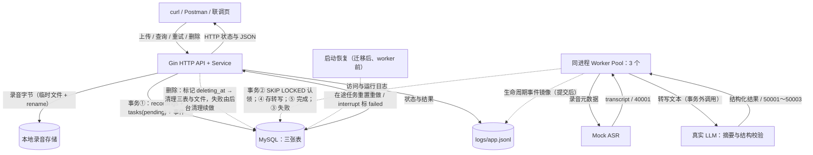
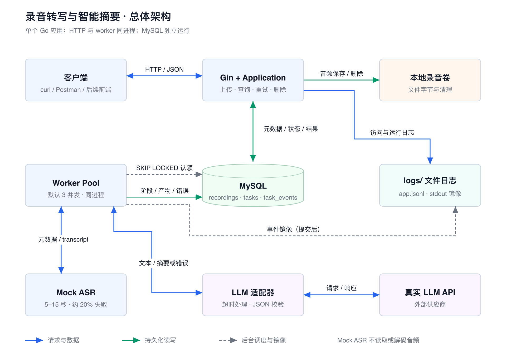

# 录音转写与智能摘要服务

这是一个 Go 后端服务：客户端上传录音文件后立即获得任务 ID；后台 worker 异步完成转写和结构化摘要；客户端可查询进度、读取结果、重试失败任务或删除录音。

服务目前的“转写”阶段是可配置的 Mock ASR，不会解析或识别音频内容。摘要阶段通过 OpenAI 兼容的 `chat/completions` 接口调用 LLM，默认配置面向小米 MiMo。这样可以先稳定验证任务流水线，再接入真实 LLM 做人工验收。

## 功能与运行边界

| 功能 | 状态 | 说明 |
| --- | --- | --- |
| 录音上传与本地存储 | 已实现 | 支持 `wav`、`mp3`、`m4a`、`aac`，单文件最大 50 MiB；相同完整内容复用已有任务 |
| 异步处理 | 已实现 | 3 个 worker；MySQL `SKIP LOCKED` 认领任务，支持进程重启恢复 |
| 任务和录音查询 | 已实现 | 任务进度、分页列表、完成后的转写文本和结构化摘要 |
| 失败重试与删除 | 已实现 | 每批最多 3 次自动指数退避；耗尽后可手动重试；删除会取消在途处理并清理关联数据 |
| LLM 摘要 | 已实现 | OpenAI 兼容适配器，严格校验 `summary`、`key_points`、`todos` 三个字段 |
| LLM 事件流 | 已实现 | SSE 实时推送任务阶段、自动重试等待与最终摘要；`/ui` 已接入展示 |
| 自动化验证 | 已实现 | 单元、MySQL 集成、过程级 golden E2E，以及 compose 全栈冒烟 |

当前部署边界是**单应用实例 + MySQL + 本地文件存储**。如果要横向扩容，需要先引入任务租约和共享文件存储。默认恢复策略会重新执行中断的摘要任务，因此在异常重启时可能产生一次额外的 LLM 调用。

## 架构总览



实线为数据和请求响应，虚线为后台调度与生命周期动作。上传经 HTTP 进入，接收文件、落盘并按内容 SHA-256 在事务中判断复用或创建：首次创建三行记录后返回 `202/pending`，同内容命中未删除录音则返回既有任务且不重复派发。空闲 worker 被 channel 唤醒（或 1s 轮询兜底），在事务②中以 SKIP LOCKED 认领任务进入 transcribing；Mock 转写成功后事务④写入 transcript 并进入 summarizing，LLM 摘要校验通过则事务⑤写 summary_json 置 done，任一阶段失败进入事务③写 failed 与对应业务错误码。删除先标记 `deleting_at` 软删除并取消在途执行，再同步清理三表与文件，失败的清理由后台循环续做；进程重启时在 worker 启动前恢复在途任务。任务依次经历 pending → transcribing → summarizing → done/failed。



完整数据流（含事务边界的端到端时序图）、ER 图与状态机见[架构文档](docs/design/architecture.md)。

## 快速开始

### 1. 首次克隆后的前置条件

需要安装并启动 Docker Desktop（含 `docker compose` 插件）和 Go 1.23.x。即使选择 Docker Compose 方式，`make start` 也会执行 `make check`，因此仍会检查 Go 工具链；可先运行：

```bash
make check
```

本项目的数据库有两种连接视角，**不要互换使用**：

| 运行位置 | 应使用的地址 | 原因 |
| --- | --- | --- |
| Compose 中的 `app` 容器 | `db:3306` | `db` 是 Compose 网络中的服务 DNS 名；容器内的 3306 是 MySQL 自身端口 |
| 宿主机上的 `make dev` / 本地客户端 | `127.0.0.1:<MYSQL_PORT>` | 宿主机不能解析 Compose 服务名 `db`，须通过发布到宿主机的端口访问 |

`make start` 会自动覆盖 app 容器的 `MYSQL_DSN` 为 `db:3306`；无需、也不应把 `.env` 中面向本地开发的 `127.0.0.1` 改成 `db`。`MYSQL_PORT` 只影响宿主机映射端口，不影响容器间始终使用的 `db:3306`。

### 2. 准备配置

```bash
make setup
```

这会从 `.env.example` 创建 `.env`，不会覆盖已有文件。至少确认下列值正确：

```dotenv
MYSQL_DSN='recording:recordingpass@tcp(127.0.0.1:3306)/recording?parseTime=true&loc=UTC'
LLM_BASE_URL=https://api.xiaomimimo.com/v1
LLM_MODEL=mimo-v2-flash
LLM_API_KEY=替换为你的真实密钥
```

`LLM_API_KEY` 为空时服务会拒绝启动。密钥只应保留在本机 `.env`，不要提交到仓库或写入日志。

若宿主机的 3306 已被其他 MySQL 占用，在 `.env` 同时改为下列配对值，再启动 Compose：

```dotenv
MYSQL_PORT=3307
MYSQL_DSN='recording:recordingpass@tcp(127.0.0.1:3307)/recording?parseTime=true&loc=UTC'
```

第一行给宿主机发布 Compose MySQL 的端口，第二行供后续 `make dev` 使用；Compose 中的 app 仍会自动访问 `db:3306`。

### 3. 方式 A：自包含 Docker Compose 启动（新机器推荐）

```bash
make start
curl http://localhost:8080/readyz
```

当 `/readyz` 返回 `200` 时，迁移和启动恢复均已完成，服务可以接收上传。服务地址为 `http://localhost:8080`；浏览器联调页在 `http://localhost:8080/ui`。

`make start` 会依次校验环境、启动本仓库的 `db` 和 `app` 容器、等待 MySQL 健康检查、执行迁移和启动恢复，再轮询 `/readyz`。首次启动会拉取或构建镜像；之后会复用已有容器和数据卷。代码改动后先执行 `make build`，再执行 `make start`。查看容器日志用 `make logs`，停止容器但保留数据卷用 `make down`。

### 4. 方式 B：本地 `make dev`（Go 进程 + 可用 MySQL）

`make dev` **只运行本机 Go 进程，不会创建数据库容器、数据库或用户**。启动前必须保证 `.env` 中的 `MYSQL_DSN` 指向一个已可访问的 MySQL 8.0+ 实例，并且 `recording` 库及 `recording` 用户已经存在。

如果没有现成 MySQL，最简单的开发组合是只启动仓库自带数据库容器：

```bash
docker compose up -d db
docker compose ps db
make dev
```

这时本机 Go 进程通过 `.env` 的 `127.0.0.1:${MYSQL_PORT}` 连接数据库。若此前执行过 `make start`，app 容器也会占用宿主机 8080；保留 db、仅停止 app 后再本地运行：

```bash
docker compose stop app
make dev
```

也可以接入自行管理的 MySQL；使用管理员账号执行一次：

```sql
CREATE DATABASE recording;
CREATE DATABASE recording_test;
CREATE USER 'recording'@'%' IDENTIFIED BY 'recordingpass';
GRANT ALL ON recording.* TO 'recording'@'%';
GRANT ALL ON recording_test.* TO 'recording'@'%';
```

然后把 `.env` 的 `MYSQL_DSN` 改为该实例的宿主、端口和凭据，再执行：

```bash
make dev
```

该命令读取 `.env` 后运行 `go run ./cmd/server` 并占用 8080；`Ctrl-C` 只会停止本机应用进程，不会停止 MySQL 容器。完成本地开发后可使用 `make down` 停止 Compose 容器，同时保留数据卷。

## 最短联调：用 Mock ASR 跑通流程

为了让结果稳定且不必等待 5–15 秒，请在 `.env` 增加：

```dotenv
MOCK_ASR_DELAY=100ms
```

然后重启服务。此模式下 Mock ASR 固定延迟后恒成功，且**只根据任务 ID**生成转写文本。以下命令直接使用仓库已有的测试录音 `api/llm-smoke-demo.wav`（即 `file:///Users/suke/Golang/recording-transcription/api/llm-smoke-demo.wav`）作为输入；在仓库根目录执行：

```bash
curl -sS -X POST http://localhost:8080/v1/recordings \
  -F 'file=@api/llm-smoke-demo.wav;type=audio/wav'
```

这里使用的是当前仓库已有的数据文件，不会临时生成占位内容。由于当前 ASR 是 Mock，上传字节用于验证文件接收、存储和异步任务链路；Mock 生成的 transcript 并不依据该音频的语义内容。

响应形如：

```json
{
  "recording_id": "…",
  "task_id": "…",
  "status": "pending"
}
```

将响应中的 ID 代入下面请求，轮询到 `done`：

```bash
curl -sS http://localhost:8080/v1/tasks/<task_id>
curl -sS http://localhost:8080/v1/recordings/<recording_id>
```

完成后的详情会包含类似 `[mock-asr] transcript for task …` 的确定性转写文本，以及 LLM 返回并校验后的 `summary`、`key_points`、`todos`。

`api/recordings.http` 提供了六个接口的可直接执行请求，适用于 VS Code REST Client 和 GoLand HTTP Client；也可以用 `/ui` 完成同一条流程。

## Mock 数据与故障演练

这里有两类 Mock，作用不同。

| 类型 | 何时使用 | 如何启用或使用 | 可验证内容 |
| --- | --- | --- | --- |
| 运行时 Mock ASR | 本地手工联调 | 配置 `MOCK_ASR_DELAY` 后重启服务 | 上传、异步状态流转、任务查询、删除和重试 |
| 测试内 FakeLLM | 自动化测试 | `make test` 自动在测试进程中启动 | 正常摘要、超时、上游 500、坏 JSON、缺字段、超大响应 |

运行时 Mock ASR 的配置如下：

| 配置 | 行为 | 适合场景 |
| --- | --- | --- |
| 不设置 `MOCK_ASR_DELAY` | 每个任务按 task ID 固定地等待 5–14.9 秒；约 20% 任务失败，重试仍会得到相同结果 | 观察接近生产的随机性和失败分支 |
| `MOCK_ASR_DELAY=100ms` | 固定延迟、恒成功 | 验证成功主链路，推荐默认使用 |
| `MOCK_ASR_DELAY=100ms` 与 `MOCK_ASR_FAIL_FIRST=true` | 每个任务首轮转写失败（`40001`），1 秒退避后自动从 attempt 2 成功 | 演示自动重试与 SSE |

自动重试在前两轮失败后等待 1 秒、2 秒；任务查询会显示 `status=pending`、递增的 `attempt` 与 `next_retry_at`。第三轮仍失败才会进入 `failed`，此时可手动启动下一批：

```bash
curl -i -X POST http://localhost:8080/v1/tasks/<task_id>/retry
curl -sS http://localhost:8080/v1/tasks/<task_id>
```

手动重试会将 `attempt` 再加一；成功后状态为 `done`。

FakeLLM 不需要也不能通过 `.env` 直接启用。它是 Go 测试中的本地 HTTP 服务器，真实摘要客户端会向它发请求。其覆盖场景和实现可见 [LLM 单元测试](tests/unit/llm_test.go) 与 [FakeLLM](internal/infrastructure/llm/fake.go)。

## 接入真实 LLM 的人工验收

在开始前，保留 `MOCK_ASR_DELAY=100ms`，这样只测试 LLM，不受 Mock ASR 随机延迟和失败影响。

1. 在 `.env` 填入真实的 `LLM_BASE_URL`、`LLM_MODEL` 和 `LLM_API_KEY`，然后重启服务。
2. 上传一个占位 `.wav` 或真实音频。当前 ASR 仍是 Mock，因此 LLM 收到的是确定性文本；这一步验证的是请求格式、认证、超时、响应解析和结果落库，而不是语音识别质量。
3. 轮询 `GET /v1/tasks/<task_id>` 至终态，并读取 `GET /v1/recordings/<recording_id>`。成功标准是 `status=done`，且 `result.summary` 为非空字符串、`result.key_points` 和 `result.todos` 为数组。
4. 临时把 `LLM_API_KEY` 改为错误值并重启，重复上传。任务应进入 `failed`，错误码为 `50002`，错误中不能出现 Key、Authorization 请求头或堆栈。
5. 在 LLM 平台核对调用次数和费用。测试结束后恢复正确配置；不要把真实 Key 写入请求文件、截图或提交记录。

真实渠道不放进自动化测试，避免产生不稳定的外部依赖与费用。已使用真实渠道完成一次人工烟测试：任务在首次执行中进入 `done`，返回了非空 `summary` 与合法的空 `key_points`、`todos` 数组。其余 LLM 错误路径由 FakeLLM 自动覆盖。

### 已接入 LLM 后的手工验收

先确保服务已经在 `http://localhost:8080` 运行。手工联调不需要启动、停止或重建服务，也不需要自动化脚本：发送一次上传请求后，直接在浏览器联调页查看任务和结果即可。

为缩短等待时间，建议在启动当前服务前设置 `MOCK_ASR_DELAY=100ms`；若未设置，生产 Mock 会等待约 5–15 秒，且约 20% 的任务会进入 `failed/40001`。两个 Mock 配置的完整用途见下文“Mock 数据与故障演练”。

使用仓库提供的测试录音上传：

```bash
curl -sS -X POST http://localhost:8080/v1/recordings \
  -F 'file=@api/llm-smoke-demo.wav;type=audio/wav'
```

该命令只做一件事：上传文件并打印服务立即返回的 `202` 响应。响应中的 `recording_id` 和 `task_id` 是随后查询任务和结果所需的标识。`idempotent_reused` 在首次内容上传时为 `false`；把同一个文件再上传一次会返回同一组 ID 并变为 `true`，不会重新创建后台任务。打开 `http://localhost:8080/ui`，将这两个 ID 粘贴到相应输入框，依次点击“查询任务”和“录音详情”即可看到完整链路。

成功时，详情响应中 `task.status` 为 `done`，`transcript` 以 `[mock-asr]` 开头，`result.summary` 为非空字符串，`result.key_points` 与 `result.todos` 为数组。若测试完成后不保留该记录，可执行：

```bash
curl -i -X DELETE "http://localhost:8080/v1/recordings/<recording_id>"
```

### 浏览器联调页

服务启动后直接访问 `http://localhost:8080/ui`。页面与 API 同源，不需要配置 CORS 或额外启动前端项目。

1. 在“上传录音”区域选择一个非空的 `.wav`、`.mp3`、`.m4a` 或 `.aac` 文件；当前 Mock ASR 下，任意非空占位文件都可用于演练。
2. 点击上传后，复制页面显示的 `recording_id` 和 `task_id`；页面会显示 `pending`、`transcribing`、`summarizing`、`done` 或 `failed`。
3. 使用“查询任务”观察状态和异步错误；成功后使用“录音详情”查看 Mock transcript 与 LLM 返回的三段摘要。
4. 使用“任务重试”验证失败任务的第二轮处理；需要稳定复现时，将 `MOCK_ASR_DELAY=100ms` 与 `MOCK_ASR_FAIL_FIRST=true` 写入 `.env` 后重启当前服务。
5. 使用“录音列表”检查分页和状态汇总；使用“删除录音”清理手工测试数据。

`/ui` 是开发联调辅助页面。上传后它会同时轮询任务并订阅 SSE，显示 `status`、自动重试等待、`summary`、`failed` 或 `deleted` 事件；摘要内容来自真实落库结果。协议级请求、响应和变量占位可使用 [`api/recordings.http`](api/recordings.http)。

## API 概览

| 方法与路径 | 说明 |
| --- | --- |
| `POST /v1/recordings` | multipart 上传，字段名 `file`；成功返回 `202`，响应含 `idempotent_reused`，相同完整内容复用已有任务 |
| `GET /v1/tasks/{task_id}` | 查询处理状态、执行轮次和异步错误 |
| `GET /v1/recordings` | 分页列表；`page` 默认 1，`page_size` 默认 20、最大 100 |
| `GET /v1/recordings/{id}` | 读取录音详情；完成后包含转写与结构化摘要 |
| `GET /v1/recordings/{id}/summary/stream` | SSE：发送 `status`、最终 `summary`、`failed` 或 `deleted`；连接存活时有 `ping` |
| `POST /v1/tasks/{task_id}/retry` | 重试失败任务；其他状态返回 `409` |
| `DELETE /v1/recordings/{id}` | 取消处理并删除录音、任务及事件数据；成功返回 `204` |
| `GET /healthz` / `GET /readyz` | 进程存活 / 服务就绪检查 |

### 上传幂等

服务在文件通过格式和大小校验后计算完整文件内容的 SHA-256。相同内容的并发或重复上传会复用同一条**未删除**录音及其转写任务，不会重复创建任务或再次投递 worker；文件名、`Content-Type` 和上传时间不参与判定。

| 场景 | HTTP 响应 | `idempotent_reused` | 结果 |
| --- | --- | --- | --- |
| 首次上传某份内容 | `202 Accepted` | `false` | 创建录音、任务和任务创建事件，并投递 worker |
| 再次上传相同内容 | `202 Accepted` | `true` | 返回已有的 `recording_id`、`task_id` 和当前任务状态；本次临时对象会被删除 |
| 相同内容正在删除 | `202 Accepted` | `false` | 新建录音和任务；不复用删除中的资源 |

响应中的 `recording_id` 与 `task_id` 是后续查询详情和轮询任务状态所需的标识。有关锁顺序、删除竞态和文件补偿的完整约束见[上传幂等设计](docs/design/upload-idempotency.md)。

失败请求使用统一结构：

```json
{
  "error": {
    "code": 30002,
    "message": "仅失败任务允许重试",
    "request_id": "req-1a2b3c"
  }
}
```

异步错误会显示在任务查询结果的 `error` 字段中。常见代码：`40001`（Mock 转写失败）、`50001`（LLM 超时）、`50002`（LLM 网络错误或非 2xx）、`50003`（LLM 输出不符合结构）。

## 自动化测试

先为隔离的测试库设置 DSN；测试启动时会检查 DSN 含 `test`，防止误连业务库：

```bash
export TEST_MYSQL_DSN='recording:recordingpass@tcp(127.0.0.1:3306)/recording_test?parseTime=true&loc=UTC'
make test
```

| 命令 | 覆盖范围 | 前提 |
| --- | --- | --- |
| `make test` | 单元测试；有 `TEST_MYSQL_DSN` 时再跑集成与过程级 E2E | Go；后两层还需独立 MySQL 测试库 |
| `make e2e` | 过程级 golden E2E | `TEST_MYSQL_DSN` |
| `E2E_COMPOSE=1 TEST_MYSQL_DSN='…' go test ./e2e/ -run TestE2ECompose -race -count=1 -v` | compose 全栈冒烟 | Docker、已构建镜像、测试 DSN |
| `make lint` | `go vet`、`gofmt`，以及已安装时的 `golangci-lint` | Go |

过程级 E2E 会用真实 HTTP、真实 MySQL、确定性 Mock ASR 和 FakeLLM 驱动主链路、重试、删除、恢复、并发和列表场景。预期结果位于 `e2e/expected/`，每次运行采集的结果位于 `e2e/actual/`；失败时检查 `e2e/diff/`。

## 数据与运维说明

数据库包含 `recordings`、`tasks`、`task_events` 三张业务表，以及用于串行化同一内容上传与删除竞态的 `recording_hash_locks` 基础设施表。初始建表在 [migrations/0001_init.sql](migrations/0001_init.sql)；[0002](migrations/0002_upload_idempotency.sql) 增加哈希锁， [0003](migrations/0003_automatic_retry.sql) 增加持久化自动重试时间与到期认领索引。服务启动时只前滚执行，测试数据库会在测试启动时自动应用全部迁移。音频字节默认写入 `DATA_DIR`，日志默认写入 `logs/app.jsonl`。

| 命令 | 作用 |
| --- | --- |
| `make check` | 检查 Docker、Compose、Go 和 `.env` 必填配置 |
| `make setup` | 创建 `.env`，不覆盖已有配置 |
| `make build` | 重建应用镜像 |
| `make start` / `make down` | 启动 / 停止 compose 服务 |
| `make logs` | 跟踪 app 与 db 容器日志 |
| `make dev` | 本地运行服务，不启动容器 |
| `make clean` | 删除本地构建产物和 `logs/`，不删除 Docker 数据卷 |

## 设计与调试资料

- [架构设计](docs/design/architecture.md)：组件、时序、状态机、数据模型和部署拓扑。
- [技术设计](docs/design/technical-design.md)：并发认领、事务、删除、恢复、错误码和 LLM 适配器约定。
- [上传幂等设计](docs/design/upload-idempotency.md)：内容哈希复用、锁顺序、删除竞态与文件补偿。
- [自动重试与摘要事件流设计](docs/design/retry-and-summary-stream.md)：退避、跨重启语义和 SSE 事件契约。
- [测试设计](docs/design/test-design.md)：测试分层、替身设施、用例和 golden 比对。
- [HTTP 请求示例](api/recordings.http)：六个 API 的手工调试请求。
- [初始迁移](migrations/0001_init.sql)：三张表的定义和索引。
- [上传幂等迁移](migrations/0002_upload_idempotency.sql)：哈希锁表和内容哈希索引。

## P0 完整性、摘要契约与已知边界

以下按需求范围复核。Mock ASR 是允许的 P0 实现；鉴权、高并发优化和公网部署不在 P0 范围内。结论是：**P0 功能和必交材料均已完成**；公网部署是唯一未实现的可选项，且本次不进行部署。

| P0 项目 | 完成证据 | 状态 |
| --- | --- | --- |
| 六个核心 API（上传、任务、列表、详情、重试、删除） | Gin 路由、`api/recordings.http`、单元/集成/E2E | 完成 |
| 上传即返与异步流水线 | MySQL 任务表、3 worker、`SKIP LOCKED` 认领、条件更新 | 完成 |
| Mock 转写与真实 LLM 摘要 | 可配置 Mock ASR；OpenAI 兼容 MiMo 适配器；真实渠道人工烟测与 FakeLLM 自动测试 | 完成 |
| 生命周期可靠性 | 事件同事务写入、启动恢复、删除取消、自动重试与手动重试 | 完成 |
| 统一错误、日志、迁移、启动与调试材料 | 数字错误码、JSON 日志、三条前滚迁移、Makefile/Compose、README | 完成 |
| 验证 | 单元、真实 MySQL 集成、golden E2E、compose 冒烟；门禁包含 `-race` | 完成 |

### 摘要格式化契约

摘要已作为 `tasks.summary_json` 的 JSON 对象持久化；录音详情的 `result` 和 SSE 的 `summary` 事件都返回同一个格式化结构，而不是字符串或数组：

```json
{
  "summary": "非空摘要文本",
  "key_points": ["非空要点"],
  "todos": ["非空待办"]
}
```

解析器拒绝 `null`、缺字段、额外字段、字段类型错误、空字符串元素、Markdown 围栏、前后混入文本及多个 JSON 值；`key_points` 和 `todos` 可合法为空数组。`/ui` 将该对象分别渲染为摘要、要点和待办，而不会把数组直接输出为未格式化文本。

### 已知边界与后续项

| 项目 | 当前实现与影响 | 后续条件 |
| --- | --- | --- |
| 音频转写语义 | Mock ASR 的 transcript 由任务 ID 派生，**不代表上传音频的实际内容**；现有 `.wav` 用于验证上传、存储和流水线 | 接入真实 ASR 后，以真实音频重新验收语义质量，并增加格式魔数和时长护栏 |
| LLM 事件流语义 | SSE 推送已落库的任务阶段与最终结构化摘要；不是供应商逐 token 输出，因为当前 LLM 适配器获取完整响应 | 若接入供应商 token stream，再单独设计背压、断线和持久化边界 |
| 单实例部署 | 本地文件存储与无任务租约只支持单应用实例 | 横向扩容前引入共享对象存储和任务租约 |
| 重启期间的模型调用 | 启动恢复可能重新执行中断的摘要，极端情况下会增加一次 LLM 调用成本 | 若需严格的外部调用去重，增加供应商幂等键/执行账本 |
| 简单公网部署 | 未部署公网；本地和单机 Docker Compose 可验收 | 按当前范围不做部署；后续需补环境隔离、密钥托管和公网观测 |

继续扩展上述任一项前，应先更新对应设计文档的数据流、状态变化和测试映射，再创建开发任务并以 TDD 实施。
