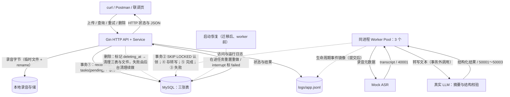

# 录音转写与智能摘要服务

上传音频即返回 202，后台 Worker 池异步完成 Mock 转写与真实 LLM 结构化摘要（summary / key_points / todos），支持任务进度查询、分页列表、详情、失败手动重试与安全删除的 Go 后端服务。核心链路已全部实现并通过单元 / 集成 / 过程级 E2E 三层测试与 compose 全栈冒烟；真实 LLM 渠道已按 OpenAI 兼容规范接入，真实渠道联调验证待 API Key（见「已知缺口与不足」）。

## 技术选型

| 维度 | 选定 | 落选方案 | 一句话理由 |
| --- | --- | --- | --- |
| 语言与框架 | Go 1.23 + Gin + GORM（底层 go-sql-driver/mysql） | — | GORM 只承担数据访问样板，关键并发路径（锁、条件更新）以 Raw SQL 显式控制 |
| 关系库 | MySQL 8.x（选型对比按 8.4 定案；本机 compose 复用已有 mysql:8.0 镜像） | PostgreSQL 16 / SQLite | `SKIP LOCKED` 队列模式形态最成熟、原生 JSON 足够存结构化摘要，熟悉度直接降低调试与运维成本 |
| 任务队列 | `tasks` 表即持久化队列 | Redis Stream / Celery 等消息队列 | 事实源即数据库，崩溃后状态不丢、零额外组件，单实例规模足够 |
| 任务调度 | channel 非阻塞唤醒 + 1s 轮询兜底 | 纯轮询 | 上传到认领毫秒级响应，轮询兜底防丢唤醒；两者都只依赖数据库 |
| 并发认领 | `FOR UPDATE SKIP LOCKED` + attempt 条件更新 | 应用内存锁 / 分布式锁 | 多 worker 取任务互不阻塞、互不重复，RowsAffected 保证同一执行轮次只有一个持有者 |
| 状态与事件 | `task_events` 与状态同事务提交，slog 镜像 `app.jsonl` | 纯文件日志 | 状态与事件原子一致，文件镜像便于按 task_id grep 全生命周期 |

表结构变更用编号 SQL 迁移文件（只前滚，不用 GORM AutoMigrate）。逐项对比与演进触发条件见[详设 §1](docs/design/technical-design.md)。

## 架构总览



实线为数据和请求响应，虚线为后台调度与生命周期动作。上传经 HTTP 进入，接收文件、落盘并在事务①中创建三行记录后即返回 202/pending，不等待任何处理；空闲 worker 被 channel 唤醒（或 1s 轮询兜底），在事务②中以 SKIP LOCKED 认领任务进入 transcribing；Mock 转写成功后事务④写入 transcript 并进入 summarizing，LLM 摘要校验通过则事务⑤写 summary_json 置 done，任一阶段失败进入事务③写 failed 与对应业务错误码。删除先标记 `deleting_at` 软删除并取消在途执行，再同步清理三表与文件，失败的清理由后台循环续做；进程重启时在 worker 启动前恢复在途任务。任务依次经历 pending → transcribing → summarizing → done/failed。


完整数据流（含事务边界的端到端时序图）、ER 图与状态机见[架构文档](docs/design/architecture.md)。

## 快速开始

```bash
make setup    # 生成 .env（已存在不覆盖），按提示填入 LLM_API_KEY
make start    # 环境自检 → 起 app+db 容器 → 等待 /readyz 就绪
```

服务地址 `http://localhost:8080`。数据库健康后应用自动执行迁移、恢复任务与删除清理，`/readyz` 返回 200 才接收上传（`/healthz` 仅表示进程存活）。全部日常操作统一经 Makefile：

| 命令 | 作用 |
| --- | --- |
| `make setup` | 复制 `.env.example` 为 `.env`（已存在不覆盖）并提示填写 `LLM_API_KEY` |
| `make check` | 环境自检：Docker/Compose、Go 版本、`.env` 关键配置逐项输出 OK / 缺失（`start` / `dev` 自动先行调用） |
| `make build` | 显式构建 / 更新 app 镜像；代码变更后执行（`start` 不自动重建已有镜像） |
| `make start` | 一键启动：先自检，起 app + db 容器并等待 `/readyz` 就绪 |
| `make dev` | 本地联调：纯 `go run` 直连 `.env` 的 MySQL，不起任何容器（见「本地联调」） |
| `make down` | 停止并移除容器；保留数据卷与 `./logs` |
| `make logs` | 跟踪 app 与 db 容器日志 |
| `make test` | 全量测试：单元恒跑；集成与 E2E golden 需 `TEST_MYSQL_DSN`（未设逐层跳过并提示） |
| `make e2e` | 仅 E2E golden（需 `TEST_MYSQL_DSN`）；另设 `E2E_COMPOSE=1` 附带 compose 全栈冒烟 |
| `make lint` | `go vet` + `gofmt`；装有 golangci-lint 则一并执行 |
| `make clean` | 清理构建产物与本地 `logs/`（不动容器与数据卷） |

配置项与默认值见 `.env.example` 注释（含测试库 `TEST_MYSQL_DSN` 示例与共享 MySQL 实例的建库语句）。

## 本地联调

- **`make dev`**：纯 `go run ./cmd/server` 直连 `.env` 里的 MySQL（本机共享实例的约定与建库语句见 `.env.example` 注释），**不起任何容器**；用过 `make start` 需先 `make down` 释放 8080。
- **Mock 转写旋钮**（环境变量，重启生效）：

  | 旋钮 | 行为 |
  | --- | --- |
  | 不设置（默认） | 生产 Mock：随机 5～15s 延迟、约 20% 转写失败（40001），种子由 task_id 决定——默认模式下撞上失败种子的任务，重试也会再失败 |
  | `MOCK_ASR_DELAY=200ms` | 切换为确定性替身：固定延迟、恒成功，快速稳定跑通全链路 |
  | `MOCK_ASR_FAIL_FIRST=true` | 配合确定性替身（需同时设置 `MOCK_ASR_DELAY`）：每任务首次转写必败、手动重试后成功——演示 失败 → retry → done 的推荐方式 |

- **LLM**：`.env` 填 `LLM_BASE_URL` / `LLM_MODEL` / `LLM_API_KEY`（任何 OpenAI 兼容端点，本项目用小米 MiMo；三项均必填，空值启动即报错）。填占位 Key 可启动：摘要阶段 failed/50002，错误分类与重试交互仍可完整演示。
- **联调入口**：浏览器联调页 `http://localhost:8080/ui`（开发辅助，同源直连无 CORS）；API 调试文件 [`api/recordings.http`](api/recordings.http)（VS Code REST Client / GoLand HTTP Client 直接可用）。

## API 概览

| 方法与路径 | 语义 |
| --- | --- |
| POST /v1/recordings | multipart 上传（字段 `file`；wav/mp3/m4a/aac，≤50MiB），202 立即返回 |
| GET /v1/tasks/{task_id} | 查询任务阶段与错误（失败任务仍 200，错误在 task.error 中） |
| GET /v1/recordings?page=1&page_size=20 | 分页列表（page_size 默认 20、最大 100，创建时间倒序） |
| GET /v1/recordings/{id} | 录音详情（done 后含 transcript 与结构化摘要） |
| POST /v1/tasks/{task_id}/retry | 手动重试（仅 failed 可重试，否则 409） |
| DELETE /v1/recordings/{id} | 删除录音文件与三表关联数据，204 |

另有 `/healthz`（进程存活）与 `/readyz`（启动恢复完成才就绪）。错误保留合理 HTTP 状态，并返回稳定的数字业务 code：

```json
{
  "error": {
    "code": 30002,
    "message": "仅失败任务允许重试",
    "request_id": "req-1a2b3c"
  }
}
```

常用错误码（40001/50001～50003 为异步执行码，只出现在任务的 `error.code` 中、不映射 HTTP）：

| code | 语义 |
| --- | --- |
| 30001 | 任务不存在（404） |
| 30002 | 任务并非 failed，不允许重试（409） |
| 40001 | Mock 转写失败 |
| 50001 / 50002 / 50003 | 摘要超时 / LLM 网络或非 2xx / 摘要输出不符合结构 |
| 90004 | 逻辑关联异常（500） |
| 90005 | 服务未就绪：启动恢复未完成或退出 drain 中（503） |

完整端点契约、码表与超时规则见详设 §8；可直接执行的请求示例见 [`api/recordings.http`](api/recordings.http)。

## 数据模型

三张表（[`migrations/0001_init.sql`](migrations/0001_init.sql)，启动时自动执行、只前滚）。表间为逻辑关联、无物理外键，成对创建与显式删除由应用事务负责；ID 为应用生成 UUID（CHAR(36) ASCII），时间统一 UTC DATETIME(6)。

**recordings** — 录音文件元数据

| 字段 | 类型 | 说明 |
| --- | --- | --- |
| id | CHAR(36) | UUID 主键 |
| original_filename | VARCHAR(512) | 上传原始文件名 |
| storage_path | VARCHAR(512) | 落盘路径，`UNIQUE` |
| extension | VARCHAR(8) | CHECK：wav / mp3 / m4a / aac |
| size_bytes | BIGINT | CHECK：> 0 且 ≤ 50MiB |
| content_hash | CHAR(64) | 上传时流式计算的 SHA-256，去重预留（可空） |
| deleting_at | DATETIME(6) | 软删除标记：NULL=正常，非空=删除中/清理未完 |
| created_at / updated_at | DATETIME(6) | 创建与更新时间 |

索引：`UNIQUE(storage_path)`；`(created_at DESC, id DESC)` 支撑列表倒序。

**tasks** — 一条录音对应一个任务，兼任持久化队列（重试复用同一 id）

| 字段 | 类型 | 说明 |
| --- | --- | --- |
| id | CHAR(36) | UUID 主键 |
| recording_id | CHAR(36) | 逻辑关联，`UNIQUE(recording_id)`：一录音一任务 |
| status | VARCHAR(32) | CHECK：pending / transcribing / summarizing / done / failed |
| attempt | INT | 执行轮次，CHECK > 0；重试 +1 |
| event_seq | BIGINT UNSIGNED | 当前事件序列，与事件表同事务推进 |
| transcript | MEDIUMTEXT | Mock 转写文本 |
| summary_json | JSON | LLM 结构化摘要（summary / key_points / todos） |
| error_code / error_message | INT / TEXT | 失败业务码与消息 |
| created_request_id | VARCHAR(64) | 创建该任务的请求 ID |
| created_at / updated_at / started_at / finished_at | DATETIME(6) | 创建 / 更新 / 本轮开始 / 终态时间 |

索引：`(status, created_at, id)` 支撑认领扫描。

**task_events** — 与状态变更同事务写入的生命周期事件

| 字段 | 类型 | 说明 |
| --- | --- | --- |
| id | BIGINT UNSIGNED | 自增主键 |
| event_id | CHAR(36) | 事件 UUID，`UNIQUE`（镜像重放去重） |
| task_id / recording_id | CHAR(36) | 逻辑关联，无物理外键 |
| event_seq | BIGINT UNSIGNED | `UNIQUE(task_id, event_seq)`：顺序与去重 |
| attempt | INT | 事件发生的执行轮次 |
| event | VARCHAR(64) | 事件名（task_created / task_claimed / task_failed 等） |
| occurred_at / level | DATETIME(6) / VARCHAR(8) | 发生时间与级别（INFO/WARN/ERROR） |
| from_status / to_status / stage | VARCHAR(32) | 状态转换与所处阶段 |
| request_id / created_request_id / instance_id | VARCHAR(64) / VARCHAR(64) / CHAR(36) | 请求与实例标识 |
| error_code / error_message | INT / VARCHAR(512) | 失败码与消息 |
| stage_elapsed_ms / attempt_elapsed_ms / task_elapsed_ms | BIGINT UNSIGNED | 阶段 / 轮次 / 全任务耗时 |
| details | JSON | 扩展细节 |

事件提交后尽力镜像到 `logs/app.jsonl`（`jq -c 'select(.task_id == "<id>")' logs/app.jsonl` 可回看完整生命周期）。字段设计说明见架构文档 §4 与详设 §2/§4。

## 测试

三层结构（设计见[测试设计](docs/design/test-design.md)）：`tests/unit` 无外部依赖，覆盖领域状态机、错误码、worker 池、LLM 适配器等；`tests/integration` 连隔离的真实 MySQL（`TEST_MYSQL_DSN`），经 httptest 验证迁移、事务、锁与各接口；`e2e/` 为过程级 golden 比对——`expected/` 手写预期结果、`actual/` 采集真实运行、逐字段深度比对（`e2e/diff` 为空即通过），另设 `E2E_COMPOSE=1` 跑 compose 全栈冒烟。`make test` 单元恒跑、集成与 E2E 需 `TEST_MYSQL_DSN`（未设逐层跳过）；`make e2e` 只跑 E2E golden。全部默认 `-race`。

## 已知缺口与不足

- **真实渠道联调验证待 API Key**：服务本身真实接入 LLM（OpenAI 兼容适配器，标准 chat/completions + Bearer）。自动化测试不调真实 LLM 是设计决定而非缺口——LLM 输出概率性、不可预测，测试统一用确定性 FakeLLM 替身，超时 / 非法输出 / 上游错误的分类已全由替身覆盖；走查中占位 Key 已实测错误路径（HTTP 401 → failed/50002，响应不含 Key 与堆栈）。拿到 Key 填入 `.env` 即可补真实渠道联调（清单见测试设计附录 A）。
- **单实例边界**：仅支持一个应用实例；多实例需先做任务租约与共享文件存储。
- **reset 恢复会重做在途任务**：默认 `RECOVERY_MODE=reset` 将中断的 transcribing/summarizing 任务重置重做，LLM 可能重复调用；12h interrupt 降级模式（在途任务标 failed/30003 等手动重试）已实现，默认关闭。
- **无上传幂等**：`content_hash` 已落库，但哈希去重未实现；上传响应丢失时重复上传会产生重复录音。
- **无失败自动重试**：失败后需手动 `POST /retry`（手动重试已交付）；自动重试 + 指数退避为候选增强。
- **生产 Mock 失败种子只看 task_id**：重试不复掷，默认模式下撞上失败种子的任务重试也会失败（演示重试请用 `MOCK_ASR_FAIL_FIRST`）。
- **公网部署未做**：无鉴权与 TLS，SSE 流式摘要与前端正式实现不在范围（`/ui` 仅为开发辅助）。
- **make lint 降级**：未安装 golangci-lint 时跳过该项，仅执行 go vet + gofmt。
- **国内网络默认源**：Dockerfile 默认 `GOPROXY=goproxy.cn`、基础镜像可经 `GO_IMAGE` / `RUNTIME_IMAGE` build-args 换加速源，均可用 build-arg 覆盖。

## 文档索引

- [docs/design/architecture.md](docs/design/architecture.md) — 总体架构：组件、端到端数据流、数据模型、状态机与部署拓扑
- [docs/design/technical-design.md](docs/design/technical-design.md) — 详细技术设计：存储选型、DDD 分层、并发模型、事务与认领协议、事件日志、错误码
- [docs/design/test-design.md](docs/design/test-design.md) — 测试设计：三层用例与 golden 比对机制
- [api/recordings.http](api/recordings.http) — 六接口 API 调试文件
- [migrations/0001_init.sql](migrations/0001_init.sql) — 初始建表迁移
