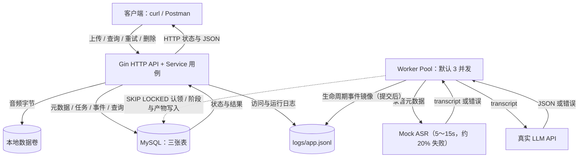
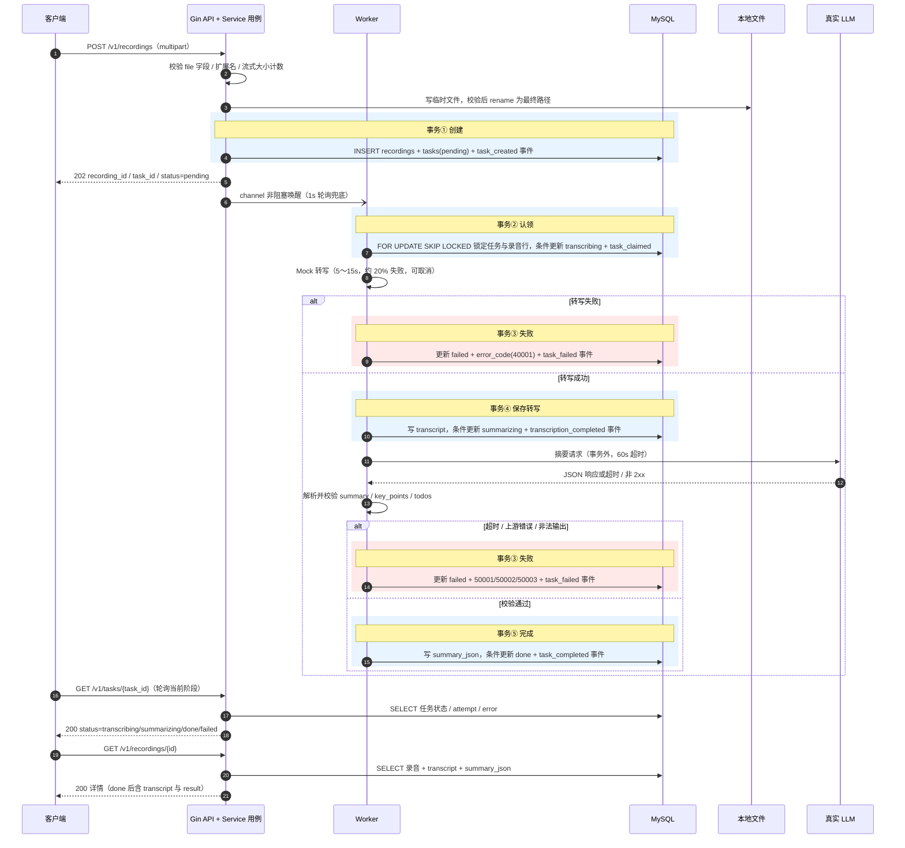
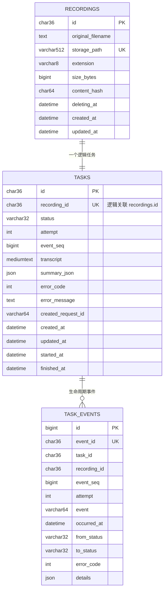
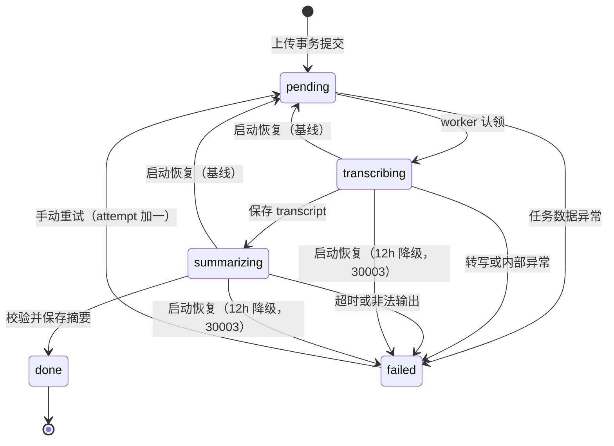
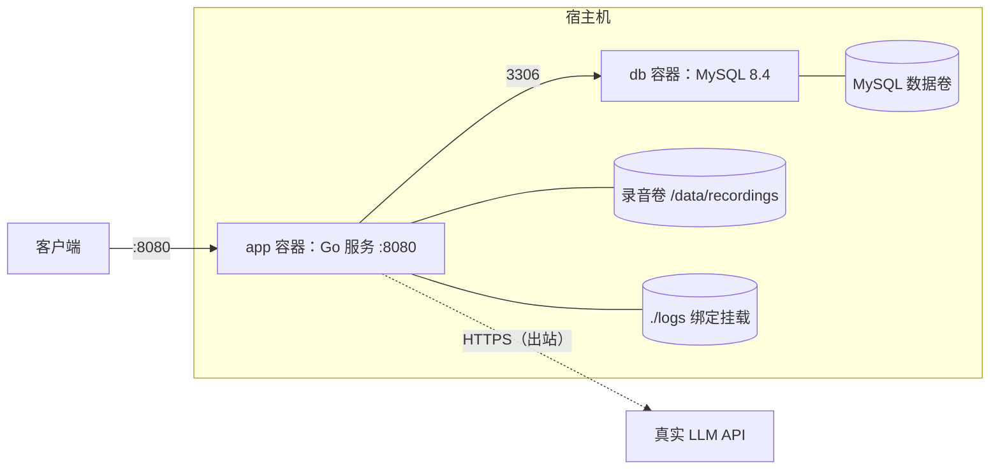

# 录音转写服务总体架构

状态：设计阶段；Go、MySQL 已确定，尚未开始业务代码实现。实现协议与选型对比见 [详细技术设计](technical-design.md)，开发任务见 [任务文档](../plan/tasks/T01-bootstrap.md)（T01～T14 顺序执行）。

依据：根目录《后端实习生笔试项目：「录音转写服务」API.md》。开发预算 12～16 小时，7 个自然日内提交。

## 1. 范围与目标

六个核心接口：上传录音、任务查询、录音列表、录音详情、失败重试、删除录音。后台流水线：上传立即返回（202 / pending），worker 异步执行 Mock 转写（随机 5～15 秒、约 20% 失败）与真实 LLM 结构化摘要（summary / key_points / todos）。

优先级：可运行、状态一致、异常可解释 > 功能数量。首轮选取的加分项为固定并发控制与核心测试；数据库任务队列同时为单实例重启恢复提供基础。真实 LLM 联调属 P0，不留到交付前。

不纳入范围：鉴权、对象存储、高并发优化和公网部署。上传幂等、自动重试和 SSE 分别由独立设计约束；`/ui` 是同源开发联调页，不引入前端业务层。真实 ASR 是后续扩展。

## 2. 总体结构与组件

单体、单应用进程、单应用实例部署。HTTP 请求与后台 worker 在同一 Go 进程内，通过 MySQL 中的任务表交接工作；task_events 与状态变更同事务记录生命周期。音频字节只落本地文件，数据库仅存路径与元数据。

| 组件 | 选择 | 职责 |
| --- | --- | --- |
| HTTP | Gin + `net/http.Server` | 路由、参数绑定、中间件；监听、超时、优雅退出 |
| 数据访问 | GORM + gorm.io/driver/mysql | 模型化 CRUD 与事务；行锁（SKIP LOCKED 锁子句）、条件更新（RowsAffected）显式控制，特殊语句 Raw 兜底 |
| 持久化 | MySQL 8.4 | 元数据、任务队列、生命周期事件（选型对比见详设 §1） |
| 文件存储 | 本地数据目录 | 音频字节；真实 ASR 阶段演进为对象存储，与数据库选型正交 |
| 异步调度 | MySQL 任务表 + 固定 worker 池 | 默认 3 个 worker；数据库是队列事实来源，channel 仅作唤醒 |
| 转写 | 可注入的 Mock Transcriber | 随机 5～15 秒、约 20% 失败；测试替换为确定性实现 |
| 摘要 | 单一真实 LLM 适配器 | 超时与非 2xx 处理、结构化输出校验（详设 §9） |
| 日志 | slog JSON → logs/app.jsonl | 任务事件提交后镜像；访问与运行日志同文件，按字段区分 |
| 部署 | Docker Compose（app + db） | 见 §6 部署拓扑 |

选型理由（数据库、异步方案、框架与日志库的完整对比）统一在 [详设 §1](technical-design.md)，本表不重复。

### 组件图

实线为数据与请求响应，虚线为后台调度。tasks 表本身承担队列职责；Mock ASR 不解码音频。

静态概览（供不支持 Mermaid 的阅读器）：，[SVG 矢量图](assets/architecture.svg)。

## 3. 端到端数据流

一个任务从上传到结果的完整旅程。事务边界在图中以底色标注：数据库状态与事件始终同事务提交，外部调用（Mock 转写、LLM）一律在事务外。

分阶段说明：

- **上传（同步部分）**：接收文件字节、校验、落盘、事务①创建三行记录后即返回 202，不等待任何处理。上传校验（含大文件处理、格式魔数与哈希去重设计）与失败补偿见详设 §5。
- **认领**：空闲 worker 被唤醒或按 1 秒轮询，短事务锁定并条件更新 pending → transcribing；多个 worker 不会认领同一执行轮次。认领 SQL 与条件更新协议见详设 §4。
- **转写**：Mock 耗时与失败概率可配置注入；成功后事务④将 transcript 与 summarizing 状态原子提交。
- **摘要**：LLM 调用与响应校验在事务外完成，只有校验通过才进入事务⑤写 done；任何失败进入事务③写 failed 与对应业务码。
- **查询**：所有查询接口只读数据库；失败任务的查询本身仍是 HTTP 200，错误经任务对象的 error 字段表达。

**失败与重试**：可重试执行失败先经持久化指数退避自动重试，最多三轮；耗尽后才写 `failed`。`POST /v1/tasks/{task_id}/retry` 仅对最终 failed 回到 pending。完整语义见[自动重试与摘要事件流设计](retry-and-summary-stream.md)。

**删除**：`DELETE /v1/recordings/{id}` 允许删除任意任务状态的录音：事务标记 deleting_at 并隐藏资源 → 取消进程内执行 → 删除文件 → 同一事务显式清理 task_events / tasks / recordings 三表 → 204。文件或清理失败返回 503，由后台低频清理续做。完整流程与迟到结果防护见详设 §5。

**重启恢复**：启动完成迁移后、worker 启动前，将 transcribing / summarizing 的在途任务重置为 pending、attempt 加一、清空本轮产物，从头重做；pending 保留待认领，done / failed 不变。12 小时紧缩方案将在途任务标记 failed / 30003，等待手动重试。逐崩溃窗口的处理动作与启动恢复流程见详设 §6。

## 4. 数据模型

三张表，均 InnoDB。一条录音对应一个逻辑任务（tasks.recording_id 唯一），重试复用 task_id 并递增 attempt；task_events 按 (task_id, event_seq) 记录跨轮次生命周期，与状态变更同事务写入。

通用约定（唯一定义处）：ID 为应用生成的 UUID，存 CHAR(36) CHARACTER SET ascii COLLATE ascii_bin；时间存 UTC DATETIME(6)，应用与数据库会话统一 UTC，API 输出 RFC3339；size_bytes 用 BIGINT，error_code 用 INT。SQL 方言、驱动与隔离级别约定见详设 §1.3 与 §4。

### recordings

| 字段 | 用途 |
| --- | --- |
| id，主键 | 录音 ID |
| original_filename | 上传文件名，仅展示 |
| storage_path，VARCHAR(512) UNIQUE | 数据目录下服务生成的相对路径 |
| extension / size_bytes | 规范化扩展名（wav/mp3/m4a/aac）与实际字节数 |
| content_hash，CHAR(64) 可空 | 流式写入时计算的 SHA-256；上传幂等的数据基础。启用后配合哈希锁表串行化，不对本列加唯一约束，详见[上传幂等设计](upload-idempotency.md#2-数据模型与串行化) |
| deleting_at，可空 | 删除流程标记：隐藏资源、拒绝新处理、供清理续做 |
| created_at / updated_at | 创建与更新时间 |

### tasks

| 字段 | 用途 |
| --- | --- |
| id，主键 | 任务 ID |
| recording_id，NOT NULL UNIQUE | 逻辑关联 recordings.id，不建物理外键 |
| status | pending / transcribing / summarizing / done / failed |
| attempt | 执行轮次，首次为 1，手动重试或重启恢复递增 |
| event_seq | 事件序号分配器，在任务行锁内递增 |
| transcript，MEDIUMTEXT 可空 | 成功转写的文本 |
| summary_json，JSON 可空 | 校验通过的结构化摘要 |
| error_code / error_message，可空 | 最近一次失败的数字业务码与公开说明 |
| created_request_id | 上传请求 ID，关联后台日志与创建请求 |
| created_at / updated_at / started_at / finished_at | 时间信息，started/finished 为本轮执行时间 |

### task_events

任务生命周期事件表，字段与事件枚举的完整定义见详设 §7；架构层面只需知道：与状态变更同事务写入，UNIQUE(task_id, event_seq) 保证顺序，提交后镜像到 logs/app.jsonl 供观察。

连接线表示逻辑关联，不是物理外键。约束与索引：

- 保留主键、NOT NULL、UNIQUE 与 CHECK（合法状态、正数 attempt、文件大小范围）；**不创建物理外键**，关联完整性由应用事务维护（成对创建、显式删除、启动巡检），理由与责任清单见详设 §4。
- 队列索引 tasks(status, created_at, id)；列表索引 recordings(created_at DESC, id DESC)；事件表仅 UNIQUE(task_id, event_seq)。
- 一条录音对应一个逻辑任务、重试复用 task_id，因此列表的“最新任务状态”直接来自该任务；不建 task_attempts 表，历史在 task_events。

## 5. 任务状态机

- **正常流转** pending → transcribing → summarizing → done；任一阶段出错进入 failed，写入数字业务码与事件。
- **手动重试** failed → pending：attempt 加一、清空上轮产物，从头执行；仅 failed 状态允许，同一轮重复请求返回 409。
- **启动恢复（基线）**：在途任务重置 pending 从头重做；**12 小时降级**：在途任务标记 failed / 30003（SERVICE_INTERRUPTED），等待手动重试。两种策略由配置选择（默认基线），逐窗口恢复动作与启动流程见详设 §6。
- 删除是录音生命周期而非任务状态，适用于全部任务状态，不在此图引入额外状态（流程见 §3 删除段）。
- 数据库不可用时 worker 停止推进并记录日志，不伪造 failed；持续失败则进程受控退出，交由下次启动恢复，避免任务永久卡住而服务看似正常。

认领与阶段写入协议（行锁顺序、`FOR UPDATE SKIP LOCKED`、条件更新匹配 id + attempt + expected_status）见详设 §4；逐条转换的写者、前置条件与并发防护矩阵见详设 §4.1。此处只约定：worker 数量即最大并发数（默认 3），认领事务提交成功才开始外部处理。

## 6. 部署拓扑

Compose 两个服务，单机部署：

- 启动顺序：db 健康检查通过 → app 执行未应用的迁移 → 启动恢复（删除清理 → 在途任务重置）→ `/readyz` 就绪；`/healthz` 表示进程存活。LLM 不进入健康检查，避免周期性消耗额度。
- 录音与 MySQL 数据用持久化卷，logs 绑定宿主机 `./logs`；容器重建后数据仍在。
- 仅支持一个 app 实例；多实例需要执行租约与共享文件存储，属后续扩展（详设 §1.5 演进触发条件）。

## 7. 相关文档

- [详细技术设计](technical-design.md)：存储选型对比、DDD 分层、并发模型、事务与认领协议、一致性边界、事件与日志、API 错误码、LLM 适配。
- [任务文档](../plan/tasks/T01-bootstrap.md)：T01～T14 逐任务开发（顺序、预算、依赖、TDD 步骤与完成勾选，同目录）。
- 题目原文：根目录《后端实习生笔试项目：「录音转写服务」API.md》。
