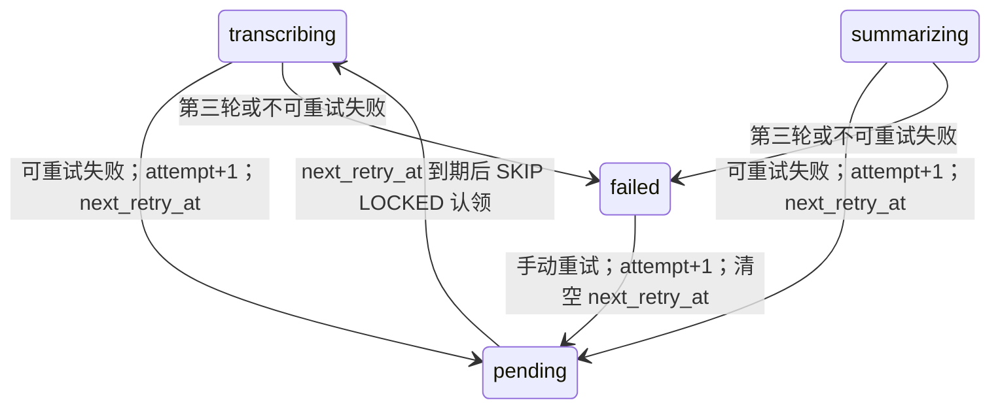

# 自动重试与摘要事件流设计

状态：已实施（T16）。本文件定义自动重试与 SSE 的唯一技术约定；既有状态、删除、恢复和错误码的通用规则仍以 [详细技术设计](technical-design.md) 为准。

## 1. 边界与契约

自动重试只处理 worker 已认领执行中产生的 `40001`、`50001`、`50002`、`50003` 和 `90001`。首次执行加两次自动重试，故同一任务最多执行三轮（`attempt=1..3`）；第三轮失败才置 `failed`。数据库持续不可用、取消、删除和停机不进入自动重试：它们沿用既有恢复或清理协议。

退避从失败事务提交的 `next_retry_at` 计算：第 1 次失败等待 1 秒，第 2 次失败等待 2 秒。等待期间任务为 `pending`，`next_retry_at` 非空，worker 的认领查询只选择到期任务。这样重启、多个 worker 和轮询都以 MySQL 为事实来源，不依赖内存 timer。手动 `POST /retry` 仅保留给三次耗尽后 `failed` 的任务；它从 `attempt=4` 开始一个新的三轮预算。

`GET /v1/recordings/{id}/summary/stream` 是同源 SSE：响应 `Content-Type: text/event-stream`，禁止缓存。它不伪造供应商 token 流；当前 OpenAI 兼容适配器只返回完整 JSON，因此服务流式发送数据库中真实可观察的任务阶段和终态摘要。

| SSE event | data | 何时发送 |
| --- | --- | --- |
| `status` | 任务 id、status、attempt、next_retry_at、error | 连接建立和任务视图变化 |
| `summary` | `summary`、`key_points`、`todos` | `done`，发送后关闭 |
| `failed` | 最终错误 | 三轮耗尽，发送后关闭 |
| `deleted` | recording_id | 资源删除/不可见，发送后关闭 |
| `ping` | `{}` | 15 秒无状态变化时，保持代理连接 |

SSE 不写数据库、不创建 goroutine 或订阅表；一个连接以 500ms 查询轮询。客户端断开时由 `Request.Context()` 停止。删除后的查询一律不泄漏删除中资源，发送 `deleted` 后关闭。

## 2. 状态、事务与并发

失败写入沿用短事务和 `task_id + attempt + expected_status` 条件更新。适配器锁任务并复查录音未删除，分配一个事件序号：未耗尽时原子写 `pending`、`attempt+1`、`next_retry_at`、最近错误和 `task_auto_retry_scheduled`；耗尽时原子写 `failed`、错误和 `task_failed`。旧轮次/删除中返回 stale，绝不安排第二次重试。认领 SQL 必须同时满足 `next_retry_at IS NULL OR next_retry_at <= UTC_TIMESTAMP(6)`，认领成功时清除 `next_retry_at` 和上轮错误。

任务事件保留每一轮失败原因；`details` 记录 `next_attempt` 与 `retry_after_ms`。SSE 只读查询，因此不能影响锁顺序、worker 吞吐或事件序列。

## 3. 数据、恢复与删除

迁移新增 `tasks.next_retry_at DATETIME(6) NULL` 和队列索引 `(status, next_retry_at, created_at, id)`。已有 `idx_tasks_queue` 可保留；迁移前已 pending 的行默认为 NULL，立即可认领。

等待退避的任务本来就是 `pending`，因此启动恢复不修改它；启动后到期即被认领。删除仍先标记 `deleting_at`，认领及自动重试条件更新均复查该标记，删除可安全清除等待任务。手动重试只接受最终 `failed`，并清空 `next_retry_at`。

## 4. 验证映射

| 编号 | 场景 | 关键断言 |
| --- | --- | --- |
| IT-19 | 三轮耗尽与人工新批次 | 两次 auto_retry_scheduled、第三轮 task_failed，手动重试从 attempt 4 成功 |
| E2E-02 | 转写自动重试 | 首轮 40001 后的 `pending/attempt=2`、退避到期认领与完成事件链 |
| E2E-03 | LLM 超时自动重试 | 首轮 50001 后的 `pending/attempt=2`、恢复渠道后自动完成 |
| E2E-10 | SSE 成功流 | 首个 status，完成后 summary，连接关闭；摘要来自真实落库结果 |
