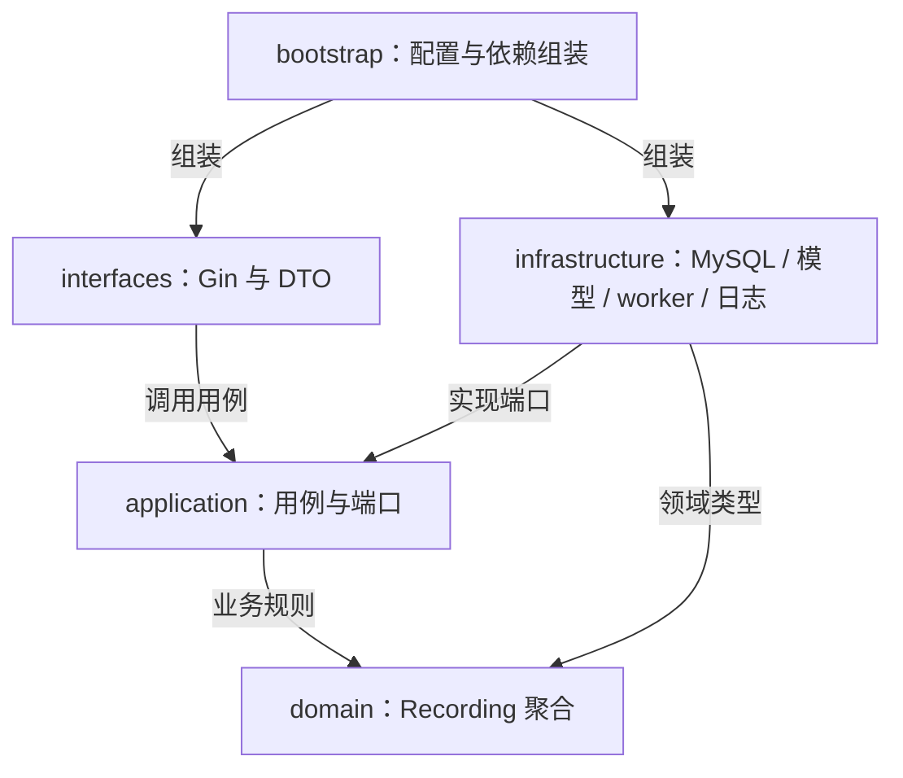
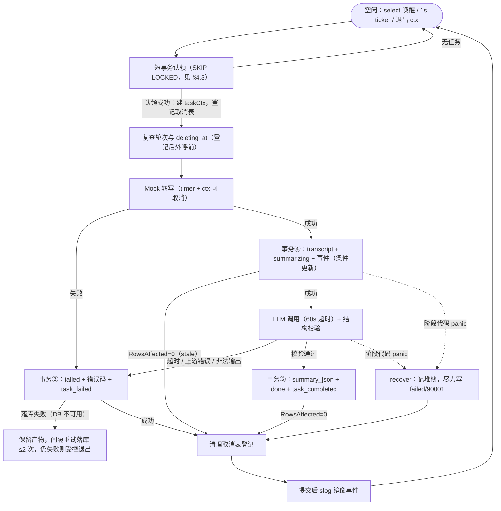
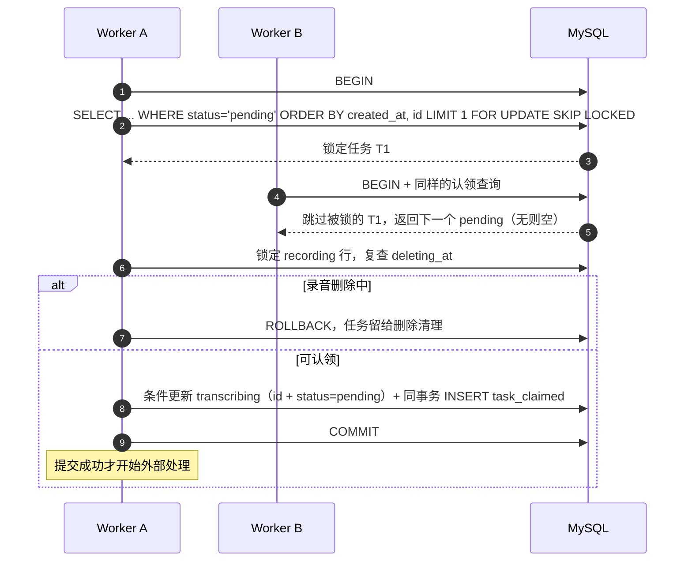
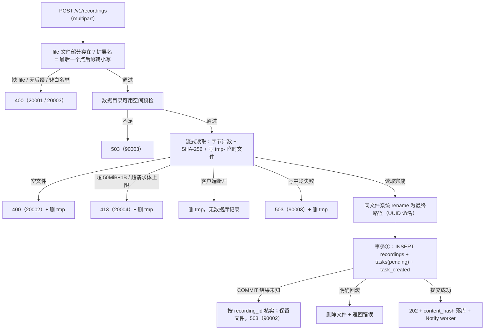
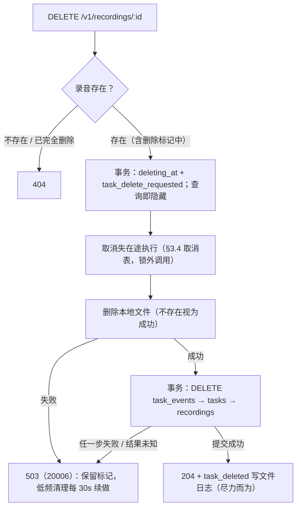
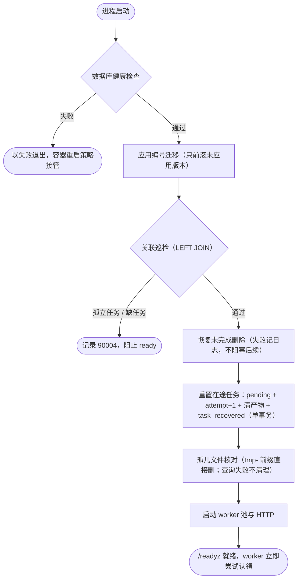

# 详细技术设计

状态：实施前设计，不表示业务代码已完成。总体结构、数据模型与状态机见 [总体架构](architecture.md)，排期与验收清单见 [开发计划](../plan/development-plan.md)。本文档是详细设计的唯一权威版本，合并了此前的数据库选型、DDD 分层、任务生命周期日志与错误码文档。

## 1. 存储选型与技术对比

### 1.1 数据放在哪里（选型前提）

选型先看数据形态，再看产品。本服务管理三类数据：

| 数据 | 特征 | 归宿 |
| --- | --- | --- |
| 录音元数据、任务状态、生命周期事件 | 强一致、强事务（状态与事件必须原子提交）、行级并发认领 | 关系库（三张表） |
| transcript / summary | 长文本 + JSON，整体写入读取，无内部字段检索需求 | 关系库列（MEDIUMTEXT / JSON） |
| 音频字节 | 大二进制、写一次读一次 | 文件系统（本地目录；库里只存 storage_path） |

由此得到一个关键结论：**接入真实 ASR 改变的是文件层（本地磁盘 → 对象存储），不构成更换数据库的理由**——音频从不进 SQL 库，转写产物仍是结构化文本。数据库选型与"是否处理真实音频"正交，后续演进见 §1.5。

### 1.2 关系型 vs 非关系型

| 方案 | 对照本题需求的评价 | 首轮 |
| --- | --- | --- |
| MongoDB | 文档模型、Schema 灵活，适合嵌套文档与动态结构。但本题没有嵌套文档查询和动态 Schema 需求；而"任务状态 + 事件同事务原子提交"恰恰是关系型强项，Mongo 多文档事务需要副本集且语义更重 | 不采用 |
| Redis | 优秀的队列与缓存组件。但持久化（AOF/RDB 快照语义）弱于 WAL 关系库，事务能力有限，不宜作为任务与状态的唯一事实源；本题也没有缓存需求。作为队列的对比见 §1.4 | 不采用 |
| 对象存储（S3 / OSS / MinIO） | 音频字节最终的正确归宿。本题单机本地磁盘已满足且免运维，引入只增加部署复杂度 | 真实 ASR 阶段演进 |

结论：任务事实源选**关系库**；Redis / 对象存储在各自合适的阶段引入（§1.5）。

### 1.3 关系库三选一：MySQL vs PostgreSQL vs SQLite

题目推荐三者任选。按本题需求的实际依赖逐项对比：

| 维度 | MySQL 8.4 | PostgreSQL 16 | SQLite 3.4x |
| --- | --- | --- | --- |
| 并发任务认领 | `SELECT ... FOR UPDATE SKIP LOCKED`，成熟队列模式 | 同样支持 `FOR UPDATE SKIP LOCKED` | 单写者库，无需行锁：原子 `UPDATE ... WHERE id = (SELECT ... LIMIT 1)` 即可 |
| JSON 存储 | 原生 JSON（语法校验、函数），满足整体存取 | JSONB，索引与查询运算符更强 | JSON1 扩展（TEXT 存储 + 函数） |
| 多表事务 | InnoDB 满足（状态+事件原子提交） | 满足 | 满足（库级写锁，单实例无影响） |
| UPDATE RETURNING | 无，需更新后在同事务 SELECT | 有，可省一次往返 | 有（3.35+） |
| 部署 | Compose 增加一个容器 + 健康检查 + 卷 | 同左 | 零容器、单文件，最省 |
| 团队熟悉度 | 熟悉：调试、运维、逐段解释成本低 | 一般 | 熟悉，但锁与并发实践机会较少 |

**结论：MySQL 8.4。** 三者技术上均可行，差异不足以单独决定；决定性因素是熟悉度直接降低调试成本，且 `SKIP LOCKED` 队列模式、显式锁顺序这些本项目的核心技术点在 MySQL 上是最常见、资料最全的形态。放弃的具体代价：PG 的 RETURNING（MySQL 用更新后同事务 SELECT 补偿）与 JSONB 检索能力（本题无 JSON 内部字段查询，不构成损失）；SQLite 的零部署（多一个 db 容器可接受，换来行级并发认领的实践与验证）。不做无基准的性能排名。

MySQL 使用约定：

- gorm.io/driver/mysql 适配器（底层仍是 go-sql-driver/mysql）；DSN 用结构化 Config 组装，`parseTime=true`、`loc=UTC`，会话 `time_zone` 设为 `+00:00`；`loc` 不等价于服务器时区，初始化连接时验证。
- 隔离级别显式设为 READ COMMITTED，不依赖默认值；主查询走主库，不引入读写分离。
- 更新后检查 RowsAffected，需要结果时在同事务重新查询（MySQL 无 RETURNING）；GORM 未覆盖的语句用 Raw 明确写出，不引入 `::jsonb` / `$1` 方言。
- 表结构变更用编号 SQL 迁移文件（满足"迁移脚本或 SQL 文件"的交付要求，建表语句即文档），GORM AutoMigrate 不用于生产迁移。
- 集成测试用真实 MySQL 隔离库验证事务、锁与 JSON，不用 SQLite 替代。
- 具体 MySQL、GORM 与驱动版本在编码开始时验证并固定到 go.mod / 构建镜像。

### 1.4 异步方案：多技术组合

题目允许任意异步实现，且要求说明选型理由与"服务重启时未完成的任务会怎样"。本方案不是单点选型，而是按职责组合多种技术，每层取最适合的工具：

| 层 | 采用技术 | 职责 | 备选与替换条件 |
| --- | --- | --- | --- |
| 事实源 | MySQL 任务表 | 任务与状态的唯一事实；status 即队列位置，重启天然可见 | Redis Stream 可作派发增强，但事实源仍留数据库，避免双写一致问题 |
| 派发 | channel 非阻塞唤醒 + 1s 轮询兜底 | 提交后立即叫醒 worker；通知丢失或合并由轮询覆盖 | 多实例时唤醒层换 Redis pub/sub / Stream，不动事实源 |
| 执行 | goroutine worker 池（默认 3） | 并发上限即 worker 数，语言原生 | 无需外部组件；吞吐不足时先加 worker，再谈分布式 |
| 可靠性 | attempt + 条件更新 + 启动恢复 | 竞态与崩溃兜底（§6） | 语义不随派发层替换而变化 |

为什么不只用内存队列（`jobs chan Task`）：任务只存在内存则重启即丢；要恢复就得扫表重排，而一旦扫表，表本身就是队列。为什么不引入 Redis：单实例下多一个组件，需处理确认、超时重投与数据库状态的双写一致，收益为负；引入触发条件见 §1.5。组合的净效果：**数据库负责"不丢"，channel 负责"快"，goroutine 负责"并发受控"，恢复协议负责"坏得了也修得好"**。

重启行为一句话：**pending 保留待认领；在途任务由启动恢复重置（基线从头重做，逐窗口处理见 §6）；done / failed 不受影响。**代价：轮询有秒级延迟（对 5～15 秒的 Mock 转写可忽略）、数据库轮询 QPS 很低（单实例、最多 3 worker）。

### 1.5 演进触发条件

明确"何时重评、重评什么"，避免无依据的提前设计：

| 触发条件 | 重评内容 | 对主库的影响 |
| --- | --- | --- |
| 接入真实 ASR | 文件层换对象存储（音频、transcript 大产物可选） | 无（音频本就不在库中） |
| 出现 JSON 字段检索 / 分析需求 | 重评 PostgreSQL（JSONB 索引）或搜索引擎 | 可能换型，需迁移评估 |
| transcript 检索 / RAG 需求 | 向量库或全文引擎 | 与主库并存，不是替换 |
| 多实例部署 | 任务租约 + 过期认领；可能引入独立队列 | 队列职责可能外移，表结构基本不变 |

### 1.6 其他技术选择

- **Gin**（vs 标准库 / Echo）：路由、中间件与绑定入口集中组织六个接口和统一错误映射；标准库可做到但样板更多，Echo 与 Gin 同质化，不维护两套、不做无需求的框架性能比较。Gin 只管 HTTP 层，后台并发由 Go 原生机制实现（§3）。
- **GORM**（vs 裸写 SQL / 纯 database/sql）：数据访问统一使用 GORM，减少手写样板、让模型与表结构保持同步；本题核心的锁、事务与条件更新语义通过显式手段保留——`Transaction` / `Begin` 管理事务边界，`Clauses(clause.Locking{Strength: "UPDATE", Options: "SKIP LOCKED"})` 控制行锁，`Where(...).Updates(...)` 后检查 `RowsAffected` 实现条件更新，GORM 未覆盖的语句用 `Raw` 明确写出。不使用关联的自动创建/删除（无 Preload 级联写），关联完整性仍由应用事务负责（§4.6）。
- **slog**（vs zap）：结构化属性、级别、JSON Handler 足够支撑本题；没有必须用 zap 的性能依据，若将来团队已有 zap 规范再替换初始化层。
- Go、Gin、驱动版本编码开始时验证固定，不以未锁定的 latest 作为交付版本。

## 2. DDD 分层与目录

一个"录音处理"限界上下文，采用接口层、应用层、领域层、基础设施层；bootstrap 组装依赖。适用于 12～16 小时预算，不引入微服务、事件总线或完整 CQRS 框架。

### 2.1 领域边界

Recording 为聚合根，ProcessingTask 为聚合内实体。录音负责文件元数据和删除生命周期；任务负责转写、摘要状态与执行轮次。Summary 是值对象，验证 summary / key_points / todos 的结构。

一个录音对应一个逻辑任务，创建和删除保持事务一致，重试复用任务 ID。这是聚合划分的依据，不根据数据库表数量机械创建多个聚合根。TaskEvent 是任务历史记录，不随聚合整体加载，也不以事件回放重建聚合：本项目不是 Event Sourcing。

统一语言：Recording（录音）、ProcessingTask（处理任务）、Attempt（执行轮次）、Summary（结构化摘要）、TaskEvent（生命周期事件）。领域错误使用具名 Go error，应用错误分类映射数字业务码，HTTP 适配层补充协议状态；领域层不依赖 Gin 或协议状态。

### 2.2 目标目录

代码实现时的目录方案；当前只维护文档，不创建空业务目录充当实现。

```text
cmd/server/main.go
internal/
  interfaces/
    http/
      handler/                 上传、查询、重试、删除
      middleware/              request_id、访问日志、错误渲染、panic 恢复
      dto/                     HTTP 请求与响应结构
      errorcode/               数字业务码到 HTTP 状态映射
      router.go
  application/
    recording/                 Upload、Get、List、Retry、Delete 用例
    processing/                Process、Recover、清理用例
    ports/                     用例消费的事务、查询、文件、转写、摘要、通知接口
    errorcode/                 数字业务码与公开消息，供 HTTP 和 worker 共用
  domain/
    recording/
      recording.go             聚合根与删除规则
      task.go                  状态、轮次与转换规则
      summary.go               结构化摘要值对象
      event.go                 领域变化的值描述，不直接写日志
      errors.go                非法状态、非法摘要等业务错误
  infrastructure/
    persistence/mysql/         GORM 模型、锁子句、迁移与事务适配；tasks + task_events 原子写入
    filestore/local/           音频保存、路径定位和删除
    asr/mock/                  Mock Transcriber
    llm/                       真实 Summarizer HTTP 适配器
    worker/                    goroutine 池、channel 唤醒、定时触发应用用例
    logging/                   slog 初始化、文件轮转、任务事件镜像
  bootstrap/
    config.go                  环境变量校验
    wire.go                    手工依赖组装
    lifecycle.go               启停、context、WaitGroup
migrations/                    MySQL 编号 SQL
api/recordings.http
logs/                          app.jsonl 与轮转文件，忽略 Git
data/recordings/               本地开发录音目录，忽略 Git
docs/design/
docs/plan/
```

### 2.3 各层职责与依赖

| 层 | 负责 | 不承担 |
| --- | --- | --- |
| 接口层 | Gin、参数转换、用例调用、HTTP/数字码映射 | SQL、任务状态规则、模型调用编排 |
| 应用层 | 用例编排、事务边界、阶段推进、补偿协调 | 具体驱动、Gin Context、文件轮转实现 |
| 领域层 | 聚合、状态转换、摘要不变量、领域错误 | 数据库、HTTP、slog、goroutine 池 |
| 基础设施层 | 实现端口、MySQL 事务、文件、模型、调度和日志 | 决定哪些业务状态允许重试 |
| bootstrap | 连接所有具体实现、配置和进程生命周期 | 业务规则 |

编译依赖向内：interfaces → application → domain；infrastructure 实现 application/ports 并使用领域类型；bootstrap 可导入所有层完成组装。domain 不导入 application/interfaces/infrastructure，application 不导入 infrastructure。



箭头是代码依赖，区别于架构文档中的运行数据流。接口放在消费方需要的边界，不为所有结构体创建接口；首轮手工依赖注入，不建通用 BaseRepository、反射注册器或无需求的领域服务。

### 2.4 事务与领域规则如何配合

应用层通过 `RecordingTransactions` 端口表达原子操作：创建聚合、认领任务、提交阶段、重试、标记删除、最终删除。端口不暴露 *gorm.DB，MySQL 适配器负责实际事务和统一锁顺序。

操作边界示例：应用准备摘要 → 调用提交阶段端口 → 适配器锁定任务和录音、加载最新领域状态 → 领域方法验证 attempt 与状态转换 → 保存任务并插入 TaskEvent → 提交后返回结果。领域规则集中定义，SQL 条件更新是最后一层并发防护；两个层面不能各自发明不同状态机。

任务认领可用专门端口实现原子 SQL，返回足够执行的快照，不要求加载历史事件。列表/详情查询返回查询 DTO，不为只读列表实例化完整聚合；这是查询优化，不引入独立读库。

持久化适配器在领域验证失败时回滚并返回领域错误；应用决定用例结果，接口层映射 409/30002 等。数字码注册表的"领域/外部错误 → 数字码、公开消息"放在 `application/errorcode/`；`interfaces/http/errorcode/` 仅补 HTTP 状态映射；worker 不导入 HTTP 包。

### 2.5 完整用例链

- 上传：Gin Handler → Upload 用例 → 文件端口保存 → 事务端口创建 Recording / Task / TaskEvent → 提交 → Notify worker → HTTP 202。
- 处理：worker 触发 Process 用例 → 原子认领 → Transcriber → 领域转换验证与持久化事件 → Summarizer → Summary 验证 → 原子保存完成状态和事件。
- 观测：TaskEvent 与状态同事务持久化，提交后由应用层发出 slog 事件记录镜像到 logs/app.jsonl（尽力而为，§7）；数据库事务内不做文件 IO。

## 3. 并发模型与协程生命周期

### 3.1 GMP 与并发参数

GMP 是 Go runtime 的调度模型（G = goroutine，M = OS 线程，P = 执行资源，P 数量对应 GOMAXPROCS），不是要自行实现的框架。保留 GOMAXPROCS 默认行为，启动日志记录实际值。三个参数各管一层约束：

- WORKER_CONCURRENCY=3：最多同时执行三个业务流水线。
- 数据库连接池上限：限制数据库连接资源。
- GOMAXPROCS：Go 代码并行执行资源，不等于 goroutine 数或业务任务数。

等待网络、数据库或 Mock timer 时其他 goroutine 可推进，但该任务仍占一个 worker 名额。不使用 LockOSThread、手工 runtime 调优或无实际分配压力的 sync.Pool。

### 3.2 协程分工

应用管理 N 个 worker、一个低频删除清理循环和生命周期协调逻辑；HTTP 内部协程由 net/http 管理。

每个 worker 循环：检查停止认领 → 短事务认领 pending → 转写 → 持久化 transcript 与 summarizing → 摘要及校验 → 持久化 done/failed → 清理执行登记 → 继续认领。每次状态事务提交后，用普通 slog 调用输出对应事件记录（§7），无独立导出协程。无任务时 select 等待 wake channel、1 秒 ticker 或退出 context，不忙循环；启动后立即尝试认领。

**每轮执行包裹 recover**：阶段代码 panic 时记录堆栈与 request/task 关联字段，并以条件更新尽力写入 failed / 90001（任务已被删除或轮次变化导致写不进则丢弃）；worker 不退出，继续认领下一个任务。没有这层 recover，一个任务的 panic 会让 goroutine 消失、任务停留在在途状态直到下次重启。阶段外呼均有显式超时（Mock timer 可取消、LLM 默认 60 秒、SQL 默认 3 秒），单任务最坏占用时间有界，首轮不引入额外的任务级总超时。

worker 单轮执行的完整控制流（成功、失败、stale 丢弃、panic 四类出口全部收敛到"清理登记 → 继续认领"）：



同一任务内转写与摘要顺序执行（摘要依赖 transcript）；不同任务之间并行。不为每次上传无限启动 goroutine，也不为两个有依赖的阶段另造两套协程池。

### 3.3 channel 唤醒方案

worker 池创建 N 个容量为 1 的 `chan struct{}`，每个 worker 接收自己的通知 channel。上传/重试提交后，service 调用池的 Notify，向所有 worker 非阻塞通知：

```go
select {
case wake <- struct{}{}:
default:
    // 已有未消费通知，合并本次唤醒；任务事实在数据库。
}
```

Notify 不启动新 goroutine、不等 worker 空闲、不携带音频或任务对象。通知后由数据库锁决定各自领取的任务；丢失或合并的通知由 1 秒轮询兜底。

通知 channel 由池拥有，可能有多个发送者，退出时不关闭（避免 send-on-closed-channel）；worker 通过 context 退出。WaitGroup 启动前 Add、协程 defer Done。不把 `jobs chan Task` 作为唯一队列：进程退出会丢内存数据；channel 只解决通知，MySQL 保存任务。

### 3.4 context 树与删除取消

| context | 来源 | 用途 | 取消条件 |
| --- | --- | --- | --- |
| requestCtx | Gin Request.Context() | 请求内同步业务与 SQL | 请求结束、断开或截止 |
| runCtx | 生命周期协调器 | 后台任务和清理 | 强制退出或不可恢复错误 |
| claimCtx | runCtx 子级 | 新任务认领与空闲等待 | 开始 drain 时取消 |
| taskCtx | runCtx 子级 | 一个 task_id + attempt 的执行 | 删除、强制退出、任务完成 |
| llmCtx | taskCtx + WithTimeout | 一次 LLM 请求与读响应 | 默认 60 秒或父级取消 |

后台任务不能继承上传请求 context，否则 HTTP 返回就可能取消任务。worker 用 runCtx 创建新 taskCtx，只携带必要标识，不保存 `*gin.Context`、multipart 对象或 ResponseWriter。context 显式作为业务/数据/适配器方法第一个参数。

模型请求使用 NewRequestWithContext、复用 Client、响应体上限及 Close。errors.Is 区分 DeadlineExceeded 与 Canceled：LLM 超时落库 50001；删除取消丢弃结果；停机取消保留在途状态供恢复。失败落库不能用已超时的 llmCtx，应在 runCtx 仍有效时另建短期限 context。

**内存取消表**：Mutex 保护 `map[ExecutionKey]context.CancelFunc`，ExecutionKey 为 task_id + attempt。worker 执行前登记、结束删除自己的键；DELETE 提交删除标记后取出 CancelFunc，在锁外调用，不持内存锁访问数据库或网络。为覆盖"删除时尚未登记"的窗口，worker 登记后、外部调用前再次检查轮次与 deleting_at。远端已收到请求时取消不保证撤销执行；数据库锁和条件更新始终保护最终写入。

Mock 延迟使用 timer + select ctx.Done，避免不可取消的长 Sleep。创建 CancelFunc 后确保调用；协程退出时 Stop ticker；所有后台协程纳入退出等待。

### 3.5 两阶段退出

signal.NotifyContext 只用于通知协调器开始退出，不直接充当 runCtx：

1. 就绪状态设为 false，取消 claimCtx，停止认领新任务/新清理工作。
2. 用独立有效的超时 context 调用 Server.Shutdown；HTTP drain 和任务 drain 共用默认 20 秒预算。
3. 已认领任务继续使用 runCtx；在途上传新提交的 pending 留待下次启动处理。
4. 超预算则取消 runCtx、必要时关闭剩余 HTTP 连接，等待 worker 收尾后关闭数据库；最终退出等待也有上限。

Server.Shutdown 管理 HTTP，不能替代后台 WaitGroup。停机取消不伪造业务 failed，重启恢复从头执行在途任务。

## 4. 事务与任务认领协议

### 4.1 状态转换矩阵与并发防护

状态机是本服务的核心正确性资产。每条出边都有**唯一写者、明确前置条件、数据库层防护**，三个机制叠加保证并发正确：

1. 固定顺序行锁（tasks → recordings）：同一任务的写者串行化，无死锁；
2. 条件更新（id + attempt + expected_status）：迟到的旧写入 RowsAffected = 0，静默丢弃；
3. 事件与状态同事务：日志不可能出现另一套状态机。

| from | 触发 | to | 唯一写者 | 前置条件 | 并发防护 | 事件 |
| --- | --- | --- | --- | --- | --- | --- |
| ∅ | 上传事务提交 | pending | 上传用例 | 校验通过、文件已 rename | 新行插入，无竞争窗口 | task_created |
| pending | worker 认领 | transcribing | worker 认领事务 | status=pending、录音未删除 | FOR UPDATE SKIP LOCKED + 条件更新，多 worker 只有一个成功 | task_claimed |
| pending | 认领时数据异常 | failed | worker | 关联/数据校验失败 | 90004 告警并停止认领 | task_failed |
| transcribing | 转写成功 | summarizing | 持有本轮 attempt 的 worker | attempt 与 status 匹配、未删除 | 行锁 + 条件更新 | transcription_completed |
| transcribing | 转写失败 / panic / 内部错误 | failed | 同上 | 同上 | 同上 | task_failed |
| summarizing | 摘要校验通过 | done | 同上 | 同上 | 同上 | task_completed |
| summarizing | 超时 / 上游错误 / 非法输出 / panic | failed | 同上 | 同上 | 同上 | task_failed |
| failed | 手动重试 | pending | HTTP 重试用例 | 行锁内复查仍为 failed | 行锁串行化并发 retry，同轮重复 409 | task_retry_accepted |
| transcribing / summarizing | 启动恢复（基线） | pending | 启动流程 | 单实例独占窗口、无 worker | 批量条件更新与事件同事务 | task_recovered |
| transcribing / summarizing | 启动恢复（降级） | failed | 启动流程 | 同上 | 同上 | task_interrupted |
| 任意 | 录音删除 | （三表删除） | 删除用例 / 后台清理 | deleting_at 已提交 | 在途条件更新被拒，迟到结果只记日志 | task_delete_requested / task_deleted |

**单写者不变量**：pending 只能被认领推进；transcribing / summarizing 只能被持有当前 attempt 的 worker 推进；failed 只能被重试推进；删除由 deleting_at 统一短路。任何时刻一个任务至多存在一个有效写者，其余写入被条件更新拒绝并丢弃——这是并发安全的根，其余机制（SKIP LOCKED、锁顺序、恢复窗口）都在维护这个不变量。

并发竞态推演（两方相撞的结果）：

- **两个 worker 抢同一 pending**：SKIP LOCKED 使后来者根本锁不到该行；即使时序错开，条件更新也只成功一次。
- **worker 落结果 vs 手动 retry**：worker 在途时 status 非 failed，retry 直接 409；worker 已失败落库、retry 将 attempt+1 后，旧轮次迟到结果被 attempt 条件拒绝。
- **worker 落结果 vs DELETE**：deleting_at 提交后，阶段写入的"未删除"复查失败，结果丢弃；反向（写入先提交）则删除按最终状态清理。
- **retry vs retry**：行锁串行，第二个在锁内复查已非 failed，返回 409。
- **DELETE vs 新认领**：认领事务锁录音行复查 deleting_at，跳过删除中任务交给清理。
- **恢复 vs 一切**：恢复在独占窗口执行（无 worker、无上传）；多实例被明确禁止（§6.4），否则启动重置会误伤其他实例在途任务。

### 4.2 连接与事务参数

READ COMMITTED + 行锁；连接池 MaxOpenConns=10、MaxIdleConns=5；数据库事务期限初值 3 秒（DB_QUERY_TIMEOUT）。一个数据库事务（`Transaction` / `Begin` 获得的会话）不跨 worker 共享；网络和文件操作在事务外。

**锁顺序规则：修改既有任务/录音统一按 tasks → recordings 顺序取得行锁**；创建新 UUID 行用独立创建事务；恢复批量更新只在单实例启动、无 worker 时执行。

### 4.3 认领

两个 worker 同时认领时的交互与隔离（SKIP LOCKED 使竞争不互相阻塞，锁后复查排除删除竞态）：



认领事务先锁任务（GORM 锁子句生成等价的 `FOR UPDATE SKIP LOCKED`）：

```go
err := tx.Clauses(clause.Locking{Strength: "UPDATE", Options: "SKIP LOCKED"}).
    Where("status = ?", domain.StatusPending).
    Order("created_at, id").
    First(&task).Error
```

然后锁定对应 recording，检查关联与 deleting_at（删除中的跳过交给清理）。候选查询可用 EXISTS 排除删除中录音避免反复选中，但快照筛选不代替锁后重查。真正孤儿触发 90004、停止认领并进入不就绪。

合法任务条件更新为 transcribing、同事务写 task_claimed 事件并在同事务 SELECT 新状态/attempt，COMMIT 后才执行外部工作。SKIP LOCKED 用于队列消费，不保证严格 FIFO，不用于需要完整视图的列表查询。

### 4.4 条件更新与事件原子性

每次阶段写入匹配 `task_id + attempt + expected_status`，且在录音行锁内确认未删除；同事务追加 task_events，事件插入失败则状态一并回滚（协议见 §7.3）。条件更新返回 RowsAffected = 0 表示任务已删除、轮次变化或状态不匹配 → 当前执行停止（stale_execution），丢弃结果，不复活任务。transcript 与 summarizing、summary_json 与 done、数字错误与 failed 分别原子提交；摘要解析在事务外完成，校验通过才写 done。

### 4.5 重试

锁后检查 failed：条件更新 attempt+1、status=pending、清空产物/错误/本轮时间字段，同事务追加 task_retry_accepted 事件并 SELECT 新状态，COMMIT 后 Notify。重复同轮请求返回 409/30002；跨轮次延迟重复的边界与后续 Idempotency-Key / expected_attempt 方案见 §8.5。

### 4.6 逻辑关联与完整性责任

tasks.recording_id 只做逻辑关联（CHAR(36) NOT NULL UNIQUE），不创建物理外键、REFERENCES、级联删除或替代外键的触发器。这不是"逻辑外键天然更快/更安全"，而是把完整性责任明确放到应用：UNIQUE 只保证录音至多一个任务，不保证被关联录音存在。

应用不变量：正常录音必须且仅有一个任务，任务必须有关联录音。实现责任：

- 创建录音和任务在同一事务提交；没有独立的创建任务接口。
- 重试只更新既有任务，不 INSERT 补建。
- 删除时同一事务显式 DELETE task_events、tasks、recordings，任一步失败整体回滚。
- 查询不用 INNER JOIN 静默隐藏损坏关联：正常录音缺任务返回 500/90004（DATA_INCONSISTENT）。

启动迁移后、worker 前，用 LEFT JOIN 巡检孤立任务和非删除中但缺任务的录音；异常记录资源 ID 与 90004 并阻止 ready，不静默修复。删除中缺任务允许继续幂等清理。

## 5. 上传与删除一致性

### 5.1 上传校验与落盘

上传的完整判定树——每个失败分支都有明确的清理动作与错误码，不留残留文件或半条记录：



正文细则：

- **请求形态**：要求名为 file 的**文件部分**存在（与同名表单值区分）；multipart 中多余的 file 部分或额外字段忽略并记 WARN 日志，不因此拒绝请求。扩展名取文件名最后一个 `.` 后缀并转小写，仅允许 wav/mp3/m4a/aac；无后缀、仅点号结尾返回 400（20003）。`a.mp3.exe` 按 exe 拒绝，`a.wav.mp3` 按 mp3 接受，不猜测意图。
- **original_filename 净化**：仅作展示元数据，路径永不使用（落盘一律服务生成的 UUID 命名），因此 `../` 与路径分隔符不构成穿越风险。存储前限长 255 字节并去除控制字符，非 UTF-8 字节替换为替换符；列表/详情原样输出，前端渲染时自行转义。
- **大文件**：大小上限 50MB = 50 × 1024 × 1024 字节（README 明示）。全程流式处理，音频字节不驻留内存；大小按流式读取的实际字节数校验（读取上限 = 限额 + 1 字节），不信任 Content-Length——声明偏小由流式计数拒绝，声明偏大由客户端自己中断；总请求体另设略大的上限预留 multipart 开销。读超时（单次读的空闲上限）与总上传超时分开配置，防慢速上传长期占用连接。写入临时文件前检查数据目录可用磁盘空间，低于阈值直接拒绝（503 / 90003）；预检只是快检，写中途失败（如并发上传写满）同样清理临时文件并返回 503 / 90003。空文件返回 400（20002）。
- **上传中途客户端断开**：读取端 context 取消 → 删除临时文件、不创建数据库记录；连接已断无响应可发，仅记访问日志。
- **格式真实性（已设计、暂不实现）**：当前按需求仅校验扩展名。音频转写服务的真实风险是改扩展名的伪造文件；流式读取时文件头部已在缓冲中，后续增加魔数嗅探成本很低——wav=RIFF…WAVE、mp3=ID3 或 0xFF Ex、m4a=ftyp box、aac=ADTS 0xFF F1。接入真实 ASR 前启用，嗅探失败按不支持文件类型返回 400。
- **去重与上传幂等（已设计、列为加分项）**：流式写入时同步计算 SHA-256（无额外读盘开销），存入 recordings.content_hash；判定以内容为准——同名不同内容哈希不同，正常创建新任务；内容相同（无论文件名是否一致）命中未删除记录时返回既有 recording_id / task_id 并标记 `idempotent_reused: true`，不产生新任务；已删除录音的哈希不阻止重新上传。首轮仅计算并存储哈希，命中复用按开发计划作为可选加分项实现（题目加分项"基于文件哈希去重"即此语义）。
- **音频时长护栏（仅设计记录）**：不解码无法测量时长，50 MiB 的低码率 mp3 可能达数小时；接入真实 ASR 时增加时长上限（解码探测或依赖供应商限制），避免单文件放大转写费用与耗时。
- **并发上传**：首轮不限制同时上传数——请求体上限约束带宽与内存，磁盘预检与写失败清理兜底磁盘；按来源限流依赖鉴权，与上传幂等一并属核心功能完成后再评估的项（开发计划 §2）。
- 流式写入数据目录临时文件（统一 `tmp-` 前缀），校验完成后关闭并**同一文件系统 rename** 为最终路径（服务生成的 ID 命名，原始文件名仅元数据），然后一个事务创建 recordings、tasks 与 task_created 事件；提交成功才返回 202 并 Notify。

### 5.2 提交结果未知与孤立文件

数据库事务明确回滚时清理文件；临时文件在失败路径关闭并清理。MySQL COMMIT 时连接断开意味着**结果未知**：不能直接删最终文件——即使按预生成的 recording_id 暂时查不到记录，也不能在原事务尚可能提交时断言失败。保守处理：返回 503、保留文件，待旧会话结束/结果确定后核对恢复。认领事务提交结果未知时同样不贸然开始外部处理，先核实或交给重启恢复。

进程恰好在 rename 后、提交前崩溃可能留下孤立文件：启动时在数据库健康、巡检通过、未接收上传前，核对数据目录文件与数据库路径，移除确定未被引用的文件；未完成 rename 的 `tmp-` 前缀临时文件直接删除，不参与核对（不可能被数据库引用）；查询失败不判孤立，清理范围限定服务自己的数据目录。恢复面向进程中断，不宣称覆盖断电与磁盘损坏（那需要 fsync、备份等额外措施）。

### 5.3 删除

允许删除任意任务状态的录音，可恢复短流程。流程图（清理失败不丢数据，标记保留续做）：



步骤细则：

1. **事务**：设置 recordings.deleting_at 并追加 task_delete_requested 事件；此后查询隐藏该录音，重试与 worker 更新均排除它。
2. 尝试取消进程内该任务的执行上下文（§3.4 取消表）；即使取消未及时生效，条件更新也会拒绝旧结果。
3. 删除本地文件；文件不存在视为成功。
4. **事务**：显式 DELETE task_events、tasks、recordings，任一步失败回滚。提交后输出 task_deleted 事件记录（slog 镜像，尽力而为）并返回 204。

文件或最终事务失败/结果未知返回 503 / 20006，保留删除标记，供客户端再次 DELETE 或后台低频清理（默认每 30 秒扫描 deleting_at 续做）重试；启动优先恢复删除再恢复任务。已标记记录的重复 DELETE 继续执行清理，不重复追加删除标记事件；已完全删除的 ID 返回 404。后台迟到结果只记录丢弃，不重建资源。

### 5.4 一致性边界

| 边界 | 方案 | 保证范围 |
| --- | --- | --- |
| 录音与任务表 | 同库事务、成对创建/显式删除 | 正常应用写入不产生半条关联 |
| 状态与阶段产物 | 行锁、attempt 条件、同事务 | 旧轮次不能覆盖新结果 |
| 数据库与通知 | 先提交、channel 唤醒、轮询兜底 | 通知丢失不丢任务 |
| 数据库与文件 | 操作顺序、删除标记、保守补偿、启动核对 | 可恢复最终一致，不保证跨系统原子提交 |
| 数据库与 LLM | 超时、验证、条件落库、重启重做 | 可能重复调用，不保证远端恰好一次 |

没有独立消息中间件双写，不增加 Outbox 表：tasks 本身就是持久化队列。

### 5.5 外部成功但落库失败

保留当前内存产物，停止推进下一阶段；同 attempt 下最多再尝试两次落库（间隔 200ms / 500ms，受 context 控制），只重试数据库写入、不重新调用模型。提交未知时核实主库状态与 attempt：同轮目标状态与产物存在即认定成功；旧轮次则丢弃；无法确定则停止推进。持续失败使服务不就绪、停止认领并受控退出，避免任务长期只留在内存。这是至少一次执行思路，可能重复计费；attempt 保护本地结果，不承诺对外的恰好一次。

### 5.6 故障矩阵

| 窗口 | 预期 |
| --- | --- |
| 文件完成、两表未提交时崩溃 | 启动核对孤立文件，不产生半条关联 |
| 两表提交、Notify 前崩溃 | pending 保留，轮询/重启认领 |
| 两个 worker 同时认领 | 只有一个取得同轮任务 |
| retry 与 DELETE 并发 | 锁顺序串行，删除标记后拒绝 retry |
| LLM 超时 | failed + 50001，GET 仍为 200 |
| 删除后模型返回 | 条件写入拒绝，不复活资源 |
| LLM 成功、done 提交前崩溃 | 恢复可能重复调用，README 明示 |
| COMMIT 结果未知 | 保留文件/产物，核实前不破坏或不安全推进 |
| 删 tasks 后删 recordings 报错 | 整体回滚，不提交半删除 |
| 应用外 SQL 破坏关联 | 启动巡检阻止 ready，不静默修复 |

## 6. 崩溃窗口与启动恢复

架构文档给出的是方向（在途任务重置、从头重做）；本节给出逐窗口的详细处理。恢复的总原则：**数据库状态是唯一事实，内存中的任何中间产物（transcript、摘要）崩溃即丢弃；恢复只依据已提交的状态，不依赖日志文件。**

### 6.1 流水线各崩溃窗口与恢复动作

| 崩溃窗口 | 落库状态 | 启动恢复动作 | 外部重复调用 |
| --- | --- | --- | --- |
| 上传：rename 后、创建事务前 | 无记录，仅有孤立文件 | 孤儿文件核对移除（数据库健康、巡检通过后） | 无 |
| 上传：创建事务提交结果未知 | 记录可能存在 | 按预生成 recording_id 核实：存在 → 保留 pending；确认不存在 → 清理文件 | 无 |
| 上传：提交后、Notify 前崩溃 | pending | 无需专门处理，启动后认领 | 无 |
| 认领提交后、转写中崩溃 | transcribing | 重置 pending、attempt+1、清空本轮产物，写 task_recovered | 无（Mock 无外部副作用） |
| transcript 写入事务提交前崩溃 | transcribing | 同上，未提交的 transcript 丢弃 | 无 |
| summarizing 阶段崩溃（LLM 调用中/返回前） | summarizing | 同上 | LLM 可能已调用：未落库即丢弃，结果作废 |
| LLM 成功、done 事务提交前崩溃 | summarizing | 同上 | **是**：恢复重做会再次调用 LLM，可能重复计费，README 明示 |
| done / failed 提交后、清理登记前崩溃 | done / failed | 终态，无需恢复 | 无 |
| 删除：deleting_at 提交后、清理完成前崩溃 | 删除标记存在 | 启动优先恢复删除：删文件 → 三表事务清理 | 无 |
| 删除：三表清理提交结果未知 | 可能已删除 | 按 recording_id 核实后收敛（已删 → 结束；未删 → 续做） | 无 |

要点：任何在途状态（transcribing / summarizing）的恢复动作一致——**重置 pending、attempt+1、清空 transcript / summary / error / 本轮时间字段**，因此实现是单条按状态的批量更新，不需要按崩溃点区分逻辑。旧 attempt 的残留事件保留在 task_events，靠轮次号区分，不清理。

### 6.2 启动恢复流程



main 中按序执行，全部完成前不开放 /readyz、不启动 worker、不接收上传（单实例独占窗口，恢复为毫秒级的批量更新加受限目录扫描）：

1. **数据库健康检查**：连接失败则以退出码失败，由容器重启策略重试。
2. **应用迁移**：执行编号 SQL 迁移，只前滚未应用的版本；迁移失败阻止启动。
3. **关联巡检**：LEFT JOIN 检查孤立任务、非删除中但缺任务的录音；异常记录 90004 并阻止 ready，不静默修复（§4.6）。
4. **恢复未完成删除**：扫描 deleting_at 非空的记录，依次删文件（不存在视为成功）→ 同事务删除 task_events / tasks / recordings；失败记录日志，不阻塞任务恢复，留给低频清理重试。
5. **重置在途任务**（单个事务）：

   ```go
   tx.Model(&Task{}).
       Where("status IN ?", []string{"transcribing", "summarizing"}).
       Updates(map[string]any{
           "status": "pending", "attempt": gorm.Expr("attempt + 1"),
           "transcript": nil, "summary_json": nil,
           "error_code": nil, "error_message": nil,
           "started_at": nil, "finished_at": nil,
       })
   ```

   同事务为每个受影响任务追加 task_recovered 事件（details 记 previous_attempt 与原状态），tasks.event_seq 相应递增。此阶段无 worker、无并发竞争，批量更新仍带状态条件（防御性）；更新与事件在同一事务，任一失败整体回滚并阻止启动。
6. **孤儿文件核对**：比对数据目录与服务生成的 storage_path 集合，删除确定未被引用的文件；数据库查询失败不清理，范围限定服务数据目录（§5.2）。
7. **启动 worker 池与 HTTP**，置 /readyz 就绪；worker 启动后立即尝试认领，恢复出的 pending 与存量 pending 一起按 created_at 顺序消费。

### 6.3 12 小时降级变体

剩余预算不足或需要避免恢复期重复调用 LLM 时，改用 RECOVERY_MODE=interrupt（默认 reset）：在途任务不重置，而是同事务更新为 failed + 30003（SERVICE_INTERRUPTED）并写 task_interrupted 事件，等待手动重试。两种模式互斥，启动时按配置选择；事件序列见 §7.1。

### 6.4 恢复边界

- 恢复重做 = 至少一次执行语义：LLM 可能被重复调用、重复计费；attempt 保证旧轮次结果不会覆盖新轮次（§4.4），不对外部服务承诺恰好一次。
- 连续多次崩溃：attempt 每次启动 +1，无上限；done / failed 永不自动重跑，pending 不会因恢复丢失。
- 恢复只处理进程中断；断电、磁盘损坏等存储级故障不在承诺范围（需要 fsync、备份等手段，超出本项目）。
- 恢复逻辑仅适用于单实例；多实例共享数据库时，启动重置会误伤其他实例的在途任务，必须先引入执行租约（§1.5）。

## 7. 任务生命周期事件与日志

决策：task_events 表与任务状态**同一事务**提交，作为可查询的任务历史；提交后用 slog 将事件镜像到 logs/app.jsonl（尽力而为，写文件失败不影响已提交状态）。不设独立导出协程、导出标记与至少一次文件保证——题目对日志的要求是"能通过日志还原一个任务的完整生命周期"，事件表 + 提交后镜像已满足。

### 7.1 关联主键与事件序列

task_id 贯穿整个生命周期，失败、重试、重启恢复均不变；attempt 区分执行轮次；event_seq 是同任务跨轮次递增的事件顺序；request_id 标识触发请求（后台无请求时为 null）；created_request_id 保留最初上传关联。

| 链路 | 事件序列 |
| --- | --- |
| 正常 | task_created → task_claimed（进入 transcribing）→ transcription_completed（进入 summarizing）→ task_completed |
| 失败/重试 | task_failed → task_retry_accepted → task_claimed → … |
| 重启恢复（基线） | task_recovered（从中断状态回 pending，details 记 previous_attempt） |
| 重启恢复（12h 降级） | task_interrupted（在途任务标 failed / 30003，等待手动重试） |
| 删除 | task_delete_requested → … → task_deleted（三表删除提交后，仅写文件日志） |

task_claimed / transcription_completed 同时表示阶段开始；外部调用的实际发出/返回属运行日志，不冒充已提交的状态变化。

### 7.2 表结构

InnoDB，逻辑关联，无物理外键。

| 字段 | MySQL 类型/约束 | 含义 |
| --- | --- | --- |
| id | BIGINT UNSIGNED AUTO_INCREMENT PRIMARY KEY | 物理定位，不作为顺序保证 |
| event_id | CHAR(36) ASCII UNIQUE NOT NULL | 应用生成 UUID，重放/去重标识 |
| task_id / recording_id | CHAR(36) ASCII NOT NULL | 逻辑关联，只存 ID |
| event_seq | BIGINT UNSIGNED NOT NULL | UNIQUE(task_id, event_seq) |
| attempt | INT NOT NULL | 本事件所属轮次 |
| event | VARCHAR(64) NOT NULL | 固定事件枚举 |
| occurred_at | DATETIME(6) NOT NULL | UTC 事件时间 |
| level | VARCHAR(8) NOT NULL | INFO / WARN / ERROR |
| from_status / to_status | VARCHAR(32)，可空 | 状态转换；删除事件可保持原状态 |
| stage | VARCHAR(32)，可空 | transcribing / summarizing |
| request_id / created_request_id | VARCHAR(64)，可空 / NOT NULL | 当前操作请求 / 创建请求 |
| instance_id | CHAR(36) ASCII NOT NULL | 事件产生实例 |
| error_code / error_message | INT / VARCHAR(512)，可空 | 数字业务错误及公开说明 |
| stage_elapsed_ms / attempt_elapsed_ms / task_elapsed_ms | BIGINT UNSIGNED，可空 | 阶段/轮次/任务总耗时 |
| details | JSON，可空 | 白名单元数据（previous_attempt 等），不含转写正文 |

索引仅 UNIQUE(task_id, event_seq)（加主键）。tasks.event_seq 为序号分配器：创建时写事件 1，此后每次事件写入在任务行锁内递增。事件写入后不修改；`SELECT * FROM task_events WHERE task_id = ? ORDER BY event_seq` 可还原跨轮次全生命周期。

### 7.3 原子性协议

事务内顺序：锁任务 → 锁录音 → 验证状态与 attempt → 更新状态/产物和 event_seq → INSERT task_events → COMMIT。任一步失败整体回滚；事件插入失败不能让状态单独提交；创建则同事务插入录音、任务与 task_created。事件携带与状态一致的 from/to 与 attempt；LLM 与文件 IO 不进事务。

应用预生成 event_id。提交结果未知时核实该 event_id 是否存在及当前状态，确认前事务结果后才重试同一操作，不生成新的逻辑事件；重复命中 UNIQUE 须验证已存在事件属于预期 task_id / attempt / 转换。

### 7.4 文件输出

```text
logs/
  app.jsonl        访问日志、任务事件镜像、上游调用、调度与异常诊断
  app.jsonl.*      轮转文件
```

单一 JSON Lines 文件，slog JSONHandler 输出，同时镜像 stdout 便于容器观察；任务事件记录与运行诊断按字段（event、task_id）区分，`jq -c 'select(.task_id == "...")' logs/app.jsonl` 即可还原一个任务的全周期。本地默认 ./logs，容器 LOG_DIR=/app/logs 并绑定宿主机 ./logs；目录可写是启动检查项；Git 忽略运行日志。

轮转：单文件 20 MiB、保留 5 个备份、最长 7 天；轮转库编码时验证固定，不手写复杂轮转。LOG_LEVEL 只过滤运行诊断，**不过滤任务事件**，避免调高级别后丢失 task_created。time 字段统一 UTC，来自 occurred_at，不能用输出时刻替代业务发生时刻。文件写失败向 stderr 报告并继续，不回滚已提交状态；数据库事件与文件日志不构成分布式事务。

示例（设计数据，非真实执行日志）：

```json
{
  "time": "2026-09-07T13:00:00Z",
  "level": "WARN",
  "msg": "摘要超时，任务失败",
  "event_id": "event-example",
  "event_seq": 4,
  "event": "task_failed",
  "task_id": "task-example",
  "recording_id": "recording-example",
  "attempt": 1,
  "instance_id": "instance-example",
  "created_request_id": "request-example",
  "request_id": null,
  "stage": "summarizing",
  "from_status": "summarizing",
  "to_status": "failed",
  "stage_elapsed_ms": 60000,
  "attempt_elapsed_ms": 68200,
  "task_elapsed_ms": 69100,
  "error": { "code": 50001, "message": "摘要生成超时" }
}
```

任务总耗时从 recordings.created_at 计算，轮次从 tasks.started_at 计算；正常耗时优先用单调时钟，跨重启总耗时为 UTC 时间差并防御负值；恢复事件无法可靠计算耗时则填 null。

### 7.5 删除时的处理

最终删除在同一事务清理 task_events / tasks / recordings，不在数据库保留已删录音的事件。task_deleted 在三表删除提交成功后追加到文件日志（带 task_id、recording_id、最后 event_seq+1、独立 event_id），不写回已清理的事件表；文件写失败仅报警，资源删除已提交仍返回 204，不假装数据库能回滚。若未来要求删除审计，另定独立审计保留政策，本轮不擅自保留已删任务的关联数据。普通重试与重启不清理历史事件。

## 8. API 契约与错误码

### 8.1 端点总表

| 接口 | 成功 | 关键响应/错误 |
| --- | --- | --- |
| POST /v1/recordings | 202 | recording_id、task_id、status=pending；缺文件/不支持扩展名/空文件 400，超限 413 |
| GET /v1/tasks/{task_id} | 200 | id、recording_id、status、attempt、error、时间；不存在/删除中 404 |
| GET /v1/recordings | 200 | items、page、page_size、total；每项含 task_id 和最新 status |
| GET /v1/recordings/{id} | 200 | 录音元数据、任务状态、transcript、result；不存在/删除中 404 |
| POST /v1/tasks/{task_id}/retry | 202 | task_id、status=pending、attempt；非 failed 为 409，不存在为 404 |
| DELETE /v1/recordings/{id} | 204 | 文件和关联数据清理完成；不存在 404，清理未完成 503 |

任务查询直接返回 transcribing / summarizing 表示当前阶段，不另造 processing 状态；详情在 transcript 可用后返回文本，done 才有 result，未生成字段为 null。分页默认 page=1、page_size=20、上限 100，非法值返回 400；排序 created_at DESC, id DESC 保证同时间稳定；超出总页数返回空数组；offset 分页在并发插入下的跨页偏移首轮接受。

### 8.2 两层错误信息

HTTP 状态码表达请求结果的通用语义（客户端、代理、监控）；业务码表达具体原因（客户端稳定分支、日志定位）。RFC 9457 的 Problem Details 不采用，沿用轻量统一 JSON error 对象。

| 层面 | 表达 | 示例 |
| --- | --- | --- |
| HTTP 请求结果 | HTTP status | 409，重试请求与任务当前状态冲突 |
| 具体业务原因 | error.code | 30002，任务不允许重试 |
| 异步执行进度 | task.status | failed，后台摘要超时 |

错误响应（HTTP 409，X-Request-ID 与响应体一致）：

```json
{
  "error": {
    "code": 30002,
    "message": "仅失败任务允许重试",
    "request_id": "req-example"
  }
}
```

code 为 JSON 整数，Go 定义具名整数类型 ErrorCode 与显式常量。编号分组：100xx 通用请求；200xx 录音与上传；300xx 任务控制；400xx 转写；500xx 摘要；900xx 基础设施与内部错误。50001 与 HTTP 500 无推导关系。一份注册表管理 code / name / HTTP status / public message；已有编号不改义、不复用，不用随 iota 变化的对外编号；message 可本地化，客户端只按 code 分支，未知码降级展示。成功响应保留题目示例的顶层字段，不强加 code=0 包装；202 仅表示受理，204 无响应体。

### 8.3 同步 API 错误码

| HTTP | 数字 code | 常量助记 | 场景 |
| --- | --- | --- | --- |
| 400 | 10001 | INVALID_ARGUMENT | multipart、UUID、分页等参数非法 |
| 400 | 20001 | FILE_REQUIRED | 缺少 file 字段 |
| 400 | 20002 | EMPTY_FILE | 文件为空 |
| 400 | 20003 | UNSUPPORTED_FILE_EXTENSION | 扩展名不支持 |
| 413 | 20004 | FILE_TOO_LARGE | 文件超过 50 MiB，或请求体超过总上限 |
| 404 | 20005 | RECORDING_NOT_FOUND | 录音不存在；读取时删除中也不可见 |
| 404 | 30001 | TASK_NOT_FOUND | 任务不存在或其录音删除中 |
| 404 | 10002 | ROUTE_NOT_FOUND | 未定义路由 |
| 405 | 10003 | METHOD_NOT_ALLOWED | 路径存在但方法不支持，保留正确 Allow 头 |
| 409 | 30002 | TASK_NOT_RETRYABLE | 任务并非 failed，包含同一轮重复重试 |
| 503 | 90002 | DATABASE_UNAVAILABLE | 数据库暂不可用；事务提交结果可能未知 |
| 503 | 90003 | FILE_STORAGE_UNAVAILABLE | 文件落盘暂不可用 |
| 503 | 20006 | RECORDING_DELETE_PENDING | 已标记删除，清理尚未完成 |
| 500 | 90001 | INTERNAL_ERROR | 未分类内部错误，不暴露实现细节 |
| 500 | 90004 | DATA_INCONSISTENT | 逻辑关联异常（正常录音缺任务等），记录告警 |

### 8.4 异步执行错误码

存入 tasks.error_code / error_message，GET 任务时放入任务对象的 error 字段；由 task_id + attempt 与日志关联。

| 数字 code | 常量助记 | 阶段 | 含义 |
| --- | --- | --- | --- |
| 40001 | ASR_FAILED | transcribing | Mock 转写失败，未来映射真实转写错误 |
| 50001 | LLM_TIMEOUT | summarizing | 超过 LLM 调用超时 |
| 50002 | LLM_UPSTREAM_ERROR | summarizing | 网络、供应商非 2xx 或外层响应异常 |
| 50003 | LLM_INVALID_OUTPUT | summarizing | 摘要 JSON 解析失败、缺字段、类型错误 |
| 90001 | INTERNAL_ERROR | 任意 | 其他内部处理异常 |
| 30003 | SERVICE_INTERRUPTED | 在途任务 | 仅 12h 降级恢复：中断任务标失败，等待手动重试 |

异步成功/处理中任务的 error 为 null；手动重试清空上轮错误。不得向客户端返回 API Key、供应商鉴权信息或内部堆栈。

### 8.5 通信失败与结果未知

通信中断时可重试幂等操作；非幂等请求不能在不知道原请求是否执行的情况下无条件自动重试（RFC 9110 §9.2.2）。

| 操作 | 超时/连接中断后的客户端策略 |
| --- | --- |
| GET 查询 | 有界退避重试；完整 JSON 才作为业务结果 |
| POST 上传 | 首轮无上传幂等，不盲目自动重发；提示结果未知，可查列表核对 |
| POST retry | 先 GET 当前状态和 attempt，再决定是否由用户再次触发 |
| DELETE | 可再次请求；204 或已删除的 404 表示资源不存在；503 删除中则稍后继续 |

failed → pending 条件更新只保证同一轮竞争请求不重复排队；前一次重试已执行并再次失败时，延迟到达的第二个 retry 可能触发下一轮。需要严格去重时增加 Idempotency-Key 持久化请求与结果，或要求 expected_attempt——首轮不实现。响应中的 request_id 用于诊断，不等于幂等键；网关 502/504 保留原 HTTP 状态，不虚构服务端业务码。

### 8.6 Gin 中间件与统一渲染

gin.New 显式安装中间件，外层到内层：RequestID → AccessLog → ErrorRenderer → PanicRecovery → 路由处理器。ErrorRenderer 在 c.Next 返回后读取 AppError 统一写 JSON；PanicRecovery 记录内部堆栈并登记 90001。NoRoute / NoMethod 走统一错误，405 设置正确 Allow 头。参数绑定选择返回错误、不提前写响应的方法再映射 AppError；上传在读取前设置总请求体上限。

统一渲染检查响应是否已写出：处理器不能既登记错误又自行写错误正文；成功头已发出后的传输错误只记日志，不尝试把已发送的 200 改为 500。

## 9. LLM 适配与输出校验

配置项：供应商地址（LLM_BASE_URL）、模型名（LLM_MODEL）、API Key（LLM_API_KEY，仅环境变量，不进 Git）、超时（LLM_TIMEOUT，默认 60s）。供应商尚未最终确定，编码时按所选渠道官方文档验证请求格式、错误语义与结构化输出支持。

通过 Summarizer 接口输入 transcript，输出校验后的 summary / key_points / todos。提示词要求：摘要忠于转写内容、没有待办时返回空数组、输出 JSON 对象；转写内容作为数据传入。复用 net/http.Client（NewRequestWithContext、响应体大小上限、及时 Close）。

必须处理：网络错误、上下文超时、非 2xx、空响应、外层结构异常、JSON 无法解析、字段类型错误。严格验证 summary 为非空字符串，key_points / todos 为存在的字符串数组且元素非空字符串，空数组允许；拒绝 null、缺字段、混入额外文本、多个 JSON 值；首轮直接拒绝 Markdown 围栏，不做"修复输出"。供应商有结构化输出能力可启用，本地验证仍必须存在。

首轮不自动重试 LLM 请求：超时或错误明确进入 failed，由手动重试恢复，控制外部费用与状态机复杂度。Mock 摘要只用于自动化测试；验收使用真实调用。

## 10. 验证要点

测试分层、替身设施、全部用例（单元 / 集成 / E2E）与 E2E 的"预期-真实"比对机制统一见 [测试设计](test-design.md)；排期与逐项验收清单见 [开发计划](../plan/development-plan.md)。技术文档只保留两条设计层约束：

- 用例从设计逐条派生并保持可追溯：状态机与条件更新用例以 §4.1 转换矩阵为唯一依据，上传 / 删除 / 恢复用例分别对应 §5.1 / §5.3 / §6 的流程图分支，每个用例标注设计依据章节。
- 并发相关包（worker 池、认领、取消表）在环境支持时执行 race 检测。

配置初值：WORKER_CONCURRENCY=3、TASK_POLL_INTERVAL=1s、LLM_TIMEOUT=60s、DB_QUERY_TIMEOUT=3s、SHUTDOWN_TIMEOUT=20s、CLEANUP_INTERVAL=30s、LOG_LEVEL=INFO；上传读超时与总超时分开设置，按 50 MiB 量级单独配置，不把短 SQL 超时套在整个上传上。首轮不新增多实例调度、独立队列、自动 ASR/LLM 重试、分布式事务或 runtime 调优。
