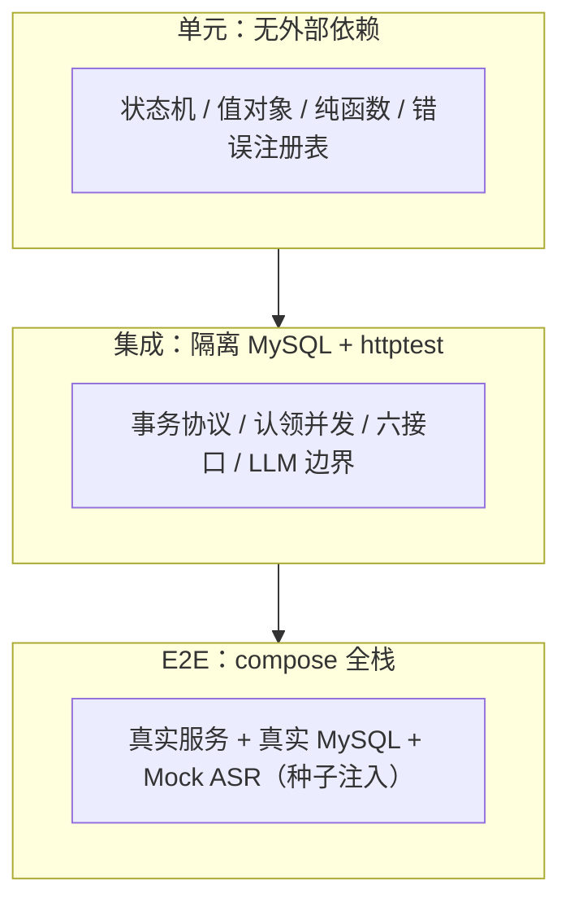

# 测试设计：单元、集成与 E2E

状态：实施前设计。对应 [总体架构](architecture.md) 与 [详细技术设计](technical-design.md)（用例的"设计依据"列指向其章节），任务排期见[任务文档](../plan/tasks/T01-bootstrap.md)（同目录 T01～T14）。

## 1. 分层策略



| 层 | 测对象 | 环境 | 替身 | 运行 |
| --- | --- | --- | --- | --- |
| 单元 | 领域状态机、Summary 值对象、扩展名解析、文件名净化、错误码注册表、唤醒协议 | 无外部依赖 | 无 | `make test`（无 DSN / 无 Docker 时自动跳过后续层） |
| 集成（MySQL） | GORM 适配器、事务协议、认领/重试/删除/恢复 | 隔离 MySQL 测试库 | 真实 MySQL | `make test`（需 TEST_MYSQL_DSN） |
| 集成（HTTP+流水线） | 六接口、错误映射、worker 流水线、LLM 边界 | httptest + 测试库 | 确定性 Transcriber + 假 LLM | 同上 |
| E2E | 完整用户旅程与故障演练 | docker compose 全栈 | Mock ASR 按种子注入、LLM 指向本地桩 | `make e2e` 单独执行；亦包含于 `make test` 全量（需 Docker） |

真实 LLM 渠道**不进自动化**：成本与稳定性都不适合，单独人工验收（附录 A）。

## 2. 替身与测试设施

- **DeterministicTranscriber**：以 task_id 为种子决定（延迟毫秒数、是否失败、产出文本），同一 task_id 结果可复现；生产 Mock 的 5～15 秒随机与 20% 失败只在真实进程使用，测试不等待、不碰运气。
- **FakeLLM（httptest.Server）**：可编程响应——正常 JSON、挂起至超时、非 2xx、坏 JSON、缺字段/类型错误、外层结构异常。
- **测试库红线**：`TEST_MYSQL_DSN` 必须包含 `test` 字样，测试初始化时校验，防止误连业务库；每个用例 TRUNCATE 三表（或事务回滚）。
- **故障注入**：事件插入失败用约束冲突制造；落库失败用包装适配器注入；panic 用阶段钩子触发；时间统一走可注入 clock。

## 3. 单元测试用例

| 编号 | 场景 | 输入 / 操作 | 预期 | 设计依据 |
| --- | --- | --- | --- | --- |
| UT-01 | 合法转换全覆盖 | 逐条执行 11 条出边 | 全部允许，from/to/attempt 正确 | §4.1 矩阵 |
| UT-02 | 非法转换拒绝 | done→pending、pending→done、done→failed、failed→summarizing 等 | 返回领域错误，状态不变 | §4.1 |
| UT-03 | attempt 隔离 | 旧 attempt（N）对新 attempt（N+1）的状态请求 | 拒绝 | §4.4 |
| UT-04 | Summary 合法值 | 非空 summary + 空 key_points/todos | 通过 | §9 |
| UT-05 | Summary 非法值 | 缺字段、null、元素空串、非字符串、Markdown 围栏、多个 JSON 值 | 全部拒绝，且能区分"缺字段"与"合法空数组" | §9 |
| UT-06 | 扩展名解析 | `A.WAV`→wav；`a.mp3.exe`→拒；`a.wav.mp3`→mp3；无后缀→拒；`.wav` 仅点号→拒 | 见左 | §5.1 |
| UT-07 | 文件名净化 | 超 255 字节截断；控制字符去除；非法 UTF-8 替换 | 长度与字符集符合约定 | §5.1 |
| UT-08 | 错误码注册表 | 全量断言 | 编号唯一、HTTP 映射完整、编号不随 iota 变化 | §8.2 |
| UT-09 | 唤醒不阻塞 | channel 已满时连续 Notify | 立即返回，无阻塞、无 panic | §3.3 |
| UT-10 | event_seq 分配 | 并发 100 次递增 | 无重复、无跳号 | §7.2 |

## 4. 集成测试用例（隔离 MySQL + httptest）

| 编号 | 场景 | 步骤 | 预期 | 设计依据 |
| --- | --- | --- | --- | --- |
| IT-01 | 上传事务成对创建 | 上传成功后查三表 | recordings/tasks/task_created 同事务可见，缺一不可 | §5.1 |
| IT-02 | 事件失败整体回滚 | 制造 event_id 重复冲突 | 状态与产物全部回滚，无半条记录 | §7.3 |
| IT-03 | 并发认领互斥 | 2 个 worker 认领同一 pending | 仅一个成功；事件恰好一条 task_claimed | §4.1/§4.3 |
| IT-04 | SKIP LOCKED 分流 | 5 个 pending + 3 worker 并发 | 各自认领不同任务，无重复、无遗漏 | §4.3 |
| IT-05 | 旧轮次写入被拒 | attempt+1 后用旧 attempt 条件更新 | RowsAffected=0，结果丢弃 | §4.4 |
| IT-06 | 并发重试 | 同一 failed 任务两个并发 retry | 一个 202 一个 409/30002，attempt 只加一次 | §4.5 |
| IT-07 | 重试前置校验 | 非 failed 重试、不存在任务重试 | 409 / 404 | §8.3 |
| IT-08 | 删除后迟到写入 | deleting_at 提交后 worker 落结果 | 条件更新拒绝，结果只记日志 | §4.1/§5.3 |
| IT-09 | 三表删除回滚 | 模拟 events 删除失败 | 整体回滚，不提交半删除 | §4.6 |
| IT-10 | 启动重置在途任务 | 构造 transcribing/summarizing 记录执行恢复 | pending、attempt+1、产物清空、task_recovered（details.previous_attempt） | §6.1/§6.2 |
| IT-11 | 恢复未完成删除 | 构造 deleting_at 记录重启恢复流程 | 文件与三表清理完成 | §6.2 |
| IT-12 | 关联巡检 | 构造孤儿任务 | 记录 90004、阻止 ready、不静默修复 | §4.6 |
| IT-13 | 哈希正确性 | 已知字节流上传 | content_hash 等于预计算 SHA-256 | §5.1 |
| IT-14 | LLM 边界映射 | FakeLLM 分别返回：挂起超时 / 500 / 坏 JSON / 缺字段 / 正常 | 50001 / 50002 / 50003 / 50003 / done+summary_json | §9 |
| IT-15 | 上传边界 | 恰好 50MiB、超 1 字节、空文件、无后缀、双后缀、多余 file 部分取第一个 | 通过 / 413 / 400 / 400 / 按最后后缀 / 忽略多余 | §5.1 |
| IT-16 | 分页行为 | 默认、上限、非法值、超总页数、同时间并列 | 20/100/400/空列表/created_at,id 倒序稳定 | §8.1 |
| IT-17 | panic 恢复 | 阶段钩子注入 panic | 任务 failed/90001，worker 继续认领下一任务 | §3.2 |
| IT-18 | 优雅退出 | SIGTERM 时有在途任务 | 停止认领；在途任务完成或保持在途供恢复，无伪 failed | §3.5 |
| IT-19 | 事件链可还原 | 成功/失败/重试/删除各跑一遍后按 task_id 查事件 | event_seq 严格递增、attempt 正确、跨轮次完整 | §7.1 |

## 5. E2E 测试：预期-真实比对

### 5.1 比对机制（golden 模式）

1. **预期结果先行构造**：按设计契约 + 确定性种子，为每个场景预先写好 golden 文件 `e2e/expected/<case>.json`，内容包括：HTTP 响应（状态码、业务码、status/attempt 字段）、任务状态序列、事件序列（event + attempt + error_code，按 event_seq）、终态产物（transcript、summary）、数据库终态断言（三表行数、字段）。
2. **真实结果采集**：`make e2e` 用 compose 起真实服务，驱动完整流程，轮询 API + 直连测试库 + 过滤 logs/app.jsonl，产出 `e2e/actual/<case>.json`。
3. **深度比对**：逐字段相等才算通过；ID、时间戳、耗时字段列入忽略清单，顺序性字段（状态序列、事件序列）按序严格比对；不一致输出 diff 并保留现场（容器日志 + 数据卷）。

### 5.2 E2E 用例

| 编号 | 场景 | 驱动 | 预期要点（golden 内容） | 设计依据 |
| --- | --- | --- | --- | --- |
| E2E-01 | 成功主链路 | 上传固定种子文件 → 轮询至 done → 查详情 | 状态序列 pending→transcribing→summarizing→done；事件链 task_created/claimed/transcription_completed/completed；attempt=1；transcript 与 summary 等于种子值 | 架构 §3 |
| E2E-02 | 转写失败→手动重试 | 种子设定首次转写失败 | failed/40001 → retry 202 → done；attempt=2；事件含 task_failed + task_retry_accepted + task_claimed | §4.5 |
| E2E-03 | LLM 超时→手动重试 | LLM 桩首次挂起 60s+ | failed/50001 → retry → done；attempt=2 | §9 |
| E2E-04 | 重试冲突与不存在 | 对 done 任务 retry；对随机 ID retry | 409/30002；404/30001 | §8.3 |
| E2E-05 | 处理中删除 | 上传后立即 DELETE | 204；随后 GET 任务/录音 404；文件不存在；三表无该 ID 残留；日志含 task_delete_requested | §5.3 |
| E2E-06 | 重启恢复 | 注入长延迟使任务停在 summarizing → `docker kill` → 重启 | 恢复后 done；attempt=2；事件含 task_recovered；logs 按 task_id 可还原全周期 | §6 |
| E2E-07 | 并发上限 | worker=3 时并发上传 5 个 | 全部 done；同一执行轮次无重复 task_claimed；完成时间体现 3 并发排队 | §3.1/§4.3 |
| E2E-08 | 列表与状态汇总 | 混合状态多任务上传后列表 | 分页正确、倒序、每项 task 状态正确 | §8.1 |

### 5.3 结果目录约定

```text
e2e/
  expected/<case>.json    先行构造的预期
  actual/<case>.json      运行采集的真实结果
  diff/<case>.txt         失败时的字段级差异
```

## 6. 通过标准

- `make test` 全绿（单元 + 集成 + E2E；环境缺失的层自动跳过并在输出中说明）；并发相关包在环境支持时 `-race` 通过；`make lint` 无告警。
- `make e2e`：全部用例 actual 与 expected 深度相等。
- 不变量巡检自动执行：测试库中不出现孤儿任务、无重复 (task_id, event_seq)、无半删除状态。
- 真实 LLM 人工验收完成后，在 README 记录脱敏的命令与响应样例。

## 附录 A：真实 LLM 人工验收清单（不进自动化）

1. 配置真实渠道后上传，确认 done 与三个摘要字段来自真实模型。
2. 人为断网/改错 Key，确认 failed/50002 且响应不含 Key 与堆栈。
3. 确认消费金额与调用次数符合预期（重启恢复场景注意重复调用）。
