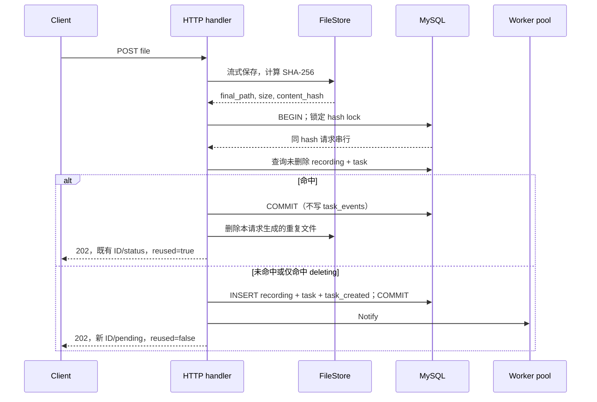
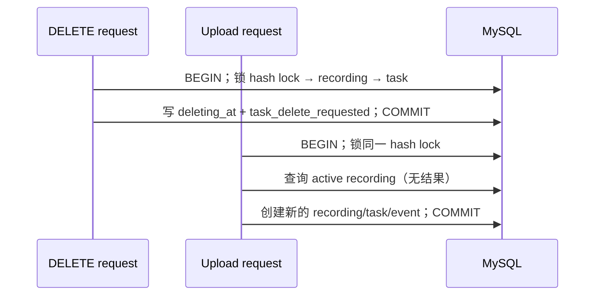

# 上传幂等设计：基于内容哈希复用

状态：实施前设计。本文是“基于文件哈希去重”功能的技术权威；总体上传流程见[详细技术设计 §5](technical-design.md#5-上传与删除一致性)，任务实施顺序见 [T15](../plan/tasks/T15-upload-idempotency.md)。

## 1. 目标与边界

`POST /v1/recordings` 已在流式写入阶段计算 SHA-256。本功能用这个内容哈希实现服务端上传幂等：相同的完整字节内容只保留一个**未删除**录音及其任务。它解决客户端在请求超时、重发或重复操作时产生重复任务的问题。

| 场景 | 返回 | 新建 recording / task / event | 唤醒 worker |
| --- | --- | --- | --- |
| 首次上传某内容 | `202`，`idempotent_reused: false` | 是 | 是 |
| 相同内容命中未删除录音 | `202`，`idempotent_reused: true` | 否 | 否 |
| 同文件名、不同内容 | `202`，`idempotent_reused: false` | 是 | 是 |
| 命中的录音已处于删除中 | 新建录音，`idempotent_reused: false` | 是 | 是 |

判定键为完整文件的 SHA-256 十六进制值，不使用文件名、文件大小或请求 ID；扩展名是展示与格式校验信息，不参与判定。因此不同名称的相同内容也会复用。功能不引入 `Idempotency-Key`，也不改变手动重试接口的 `attempt` 语义。

复用的对象可以处于 `pending`、处理中、`done` 或 `failed`。响应中的 `status` 是事务读取时既有任务的当前状态；客户端若需要结果或错误，继续使用 `task_id` 查询。HTTP 仍使用 `202`，表示上传请求已被服务接受；它不表示每次请求都新建了后台工作。

## 2. 数据模型与串行化

仅为 `recordings.content_hash` 增加普通索引不足以防止并发上传发生“都未查到，再各自插入”的竞态。也不能给 `content_hash` 加唯一索引：删除中的旧录音必须允许相同内容创建新录音。

新增一张持久的哈希锁表，每一个见过的内容哈希一行：

```sql
CREATE TABLE recording_hash_locks (
    content_hash CHAR(64) CHARACTER SET ascii COLLATE ascii_bin NOT NULL,
    created_at   DATETIME(6) NOT NULL,
    PRIMARY KEY (content_hash)
) ENGINE = InnoDB DEFAULT CHARSET = utf8mb4;

CREATE INDEX idx_recordings_content_hash ON recordings (content_hash);
```

`recording_hash_locks` 不是业务资源，不保存录音 ID，也不在删除录音时移除。它的唯一职责是成为同一哈希的持久互斥点；保留历史锁行可以避免“删除锁行”和新上传之间重新出现竞态。其空间成本为每个不同内容一行 64 字符哈希和时间戳，在本项目的单机范围内可接受。录音表上的普通索引只用于锁定后的有效录音查询。

所有会改变或判定某个内容哈希可复用性的事务都遵守以下锁顺序：


上传在开启业务事务前用独立的 `INSERT IGNORE` 确保持久锁行存在；该语句只创建不可见的基础设施元数据，不创建 recording、task 或 event。随后业务事务以 `SELECT ... FOR UPDATE` 锁定该行。这样避免首个哈希被多个事务同时 `INSERT IGNORE` 后再请求行锁时的 InnoDB insert-intention 死锁。两个相同哈希的业务事务仍在这一行串行；事务拿到锁后，才可查询 `content_hash = ? AND deleting_at IS NULL` 的录音及其唯一任务。删除标记同样先确保并锁定该哈希锁行，再锁录音与任务，随后写入 `deleting_at` 和 `task_delete_requested`。这样，删除先完成标记时，随后上传不会复用该记录；上传先线性化为复用时，后续删除仍按原删除协议收敛。不同哈希之间不互相等待。

## 3. 数据流

### 3.1 上传主流程

文件校验、流式写入、临时文件清理和最终路径 rename 保持既有 §5.1 规则。哈希只在完整读取完成后可信，因此去重判断发生在 rename 后、数据库事务中。



事务内的“命中”分支只读既有 `recordings`/`tasks`，除了首次见到该哈希时创建锁行外，不写录音、任务和事件。提交成功后才删除本请求生成的最终文件；文件 I/O 不放进数据库事务。删除失败返回 `503/90003` 并记录该最终路径，启动时的孤儿文件核对会再次清理。由于数据库已能明确查到复用目标，客户端可安全以相同内容重试；重复上传仍不会创建新任务。

### 3.2 删除并发流程



若上传先取得锁并读取到活跃记录，它返回该记录；DELETE 随后可将该记录标记删除。这是以“上传事务中读取到的状态”为线性化点的正常结果，客户端应以查询接口获取随后变化的最终状态。删除中记录不会被后续上传复用。

## 4. 事务、文件与故障处理

| 阶段 | 明确失败 | COMMIT 结果未知 | 成功后的动作 |
| --- | --- | --- | --- |
| 新建分支 | 回滚后删除本次最终文件 | 保留文件，返回 `503/90002`，按预生成 recording ID 核实 | Notify 一次 |
| 复用分支 | 回滚后删除本次最终文件 | 保留文件，返回 `503/90002`；恢复期按孤儿文件规则核对 | 不 Notify |
| 复用文件删除 | 返回 `503/90003`，保留待孤儿清理 | 不适用 | 返回复用响应 |

对“提交结果未知”继续采用既有保守规则：不得因查询瞬时未见记录就删除最终文件。新建分支用预生成的 `recording_id` 复核；复用分支重新获得哈希锁后复核活跃录音。确认前不返回成功，也不发出 worker 通知，避免把可能回滚的工作推进到外部。

服务启动时原有孤儿核对需把“当前不被任何 recording 引用”的重复文件纳入删除对象。`recording_hash_locks` 无文件路径，不影响该判断。

## 5. 应用与 HTTP 契约

上传用例的事务端口从“只创建”扩展为一个原子判定操作。端口返回值表达是否复用，应用层据此决定文件补偿与通知；HTTP handler 不自行查询数据库或作内存去重。

```go
type CreateOrReuseResult struct {
    RecordingID string
    TaskID      string
    Status      domain.TaskStatus
    Reused      bool
}

type RecordingTx interface {
    CreateOrReuseByContentHash(ctx context.Context, in CreateInput) (CreateOrReuseResult, error)
}

type UploadResult struct {
    RecordingID       string
    TaskID            string
    Status            domain.TaskStatus
    IdempotentReused  bool
}
```

`POST /v1/recordings` 的成功响应增加必填布尔字段，旧字段与状态码保持不变：

```json
{
  "recording_id": "existing-or-new-recording-id",
  "task_id": "existing-or-new-task-id",
  "status": "existing-or-new-task-status",
  "idempotent_reused": false
}
```

所有上传成功响应都显式返回该字段，不能用省略字段表示 `false`。`recording_id`、`task_id` 和 `status` 在复用时来自已有数据，不得返回本次预生成但未落库的 ID。

## 6. 验证与可追溯性

| 编号 | 场景 | 关键断言 |
| --- | --- | --- |
| IT-20 | 同字节顺序上传 | 第二次 `202/reused=true`；两个 ID 相同；三表仍各一条；只一条 `task_created`；数据目录只保留首个文件 |
| IT-21 | 同名异内容 | 两次均 `reused=false`；两个 recording/task；各自 `task_created` |
| IT-22 | 删除中后重传 | 先标记删除但不完成清理；重传得到新 ID 与 `reused=false`；旧记录不被返回 |
| IT-23 | 同字节并发上传 | 所有请求 202；恰一条 `reused=false`，其余为 true；仅一套业务行和一条创建事件 |
| E2E-09 | 同字节重复上传 | 经真实 HTTP 流程验证响应字段、相同 ID、单次 worker 消费和目录文件收敛 |

测试必须使用真实 MySQL，不能以进程内 mutex 或 SQLite 替代；IT-23 应设置 worker 为停用或确定性慢替身，使断言只关注上传事务。每个测试在开始前清理 `recording_hash_locks`，使测试库之间没有残留哈希锁行。
